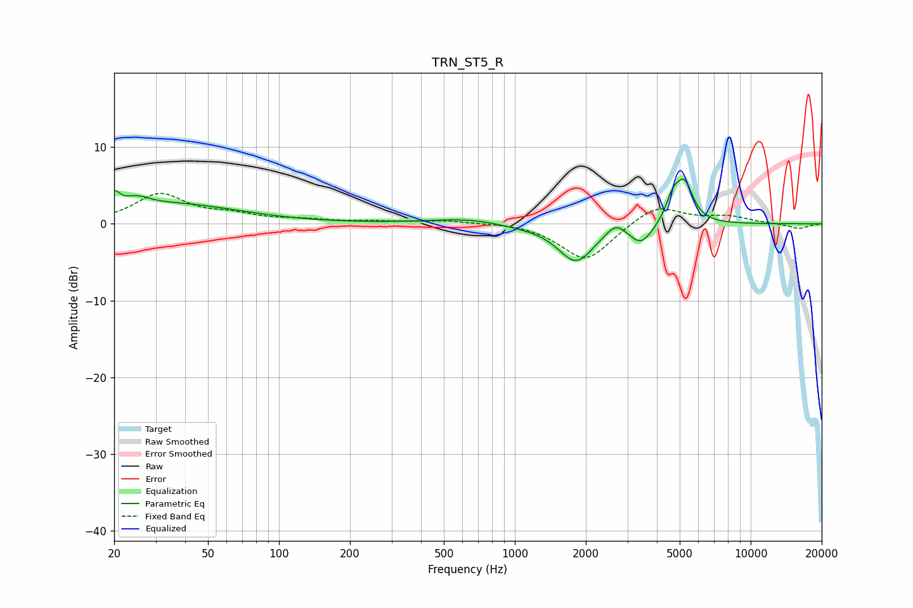

# TRN_ST5_R
See [usage instructions](https://github.com/jaakkopasanen/AutoEq#usage) for more options and info.

### Parametric EQs
Apply preamp of -5.9 dB when using parametric equalizer.

|   # | Type    |   Fc (Hz) |    Q |   Gain (dB) |
|-----|---------|-----------|------|-------------|
|   1 | Peaking |        20 | 6    |         2   |
|   2 | Peaking |        25 | 2.58 |         1.2 |
|   3 | Peaking |        36 | 0.51 |         2.5 |
|   4 | Peaking |       649 | 0.86 |         0.8 |
|   5 | Peaking |      1012 | 1.25 |        -0.3 |
|   6 | Peaking |      1816 | 1.85 |        -4.9 |
|   7 | Peaking |      2679 | 3.43 |         1.6 |
|   8 | Peaking |      3428 | 2.88 |        -2.6 |
|   9 | Peaking |      4679 | 4.7  |         2.8 |
|  10 | Peaking |      5243 | 3.83 |         5   |

### Fixed Band EQs
When using fixed band (also called graphic) equalizer, apply preamp of **-4.1 dB** (if available) and set gains manually with these parameters.

|   # | Type    |   Fc (Hz) |    Q |   Gain (dB) |
|-----|---------|-----------|------|-------------|
|   1 | Peaking |        31 | 1.41 |         3.8 |
|   2 | Peaking |        62 | 1.41 |         1   |
|   3 | Peaking |       125 | 1.41 |         0.4 |
|   4 | Peaking |       250 | 1.41 |         0.2 |
|   5 | Peaking |       500 | 1.41 |         0.4 |
|   6 | Peaking |      1000 | 1.41 |         0.2 |
|   7 | Peaking |      2000 | 1.41 |        -4.9 |
|   8 | Peaking |      4000 | 1.41 |         2.6 |
|   9 | Peaking |      8000 | 1.41 |         0.9 |
|  10 | Peaking |     16000 | 1.41 |        -0.7 |

### Graphs

