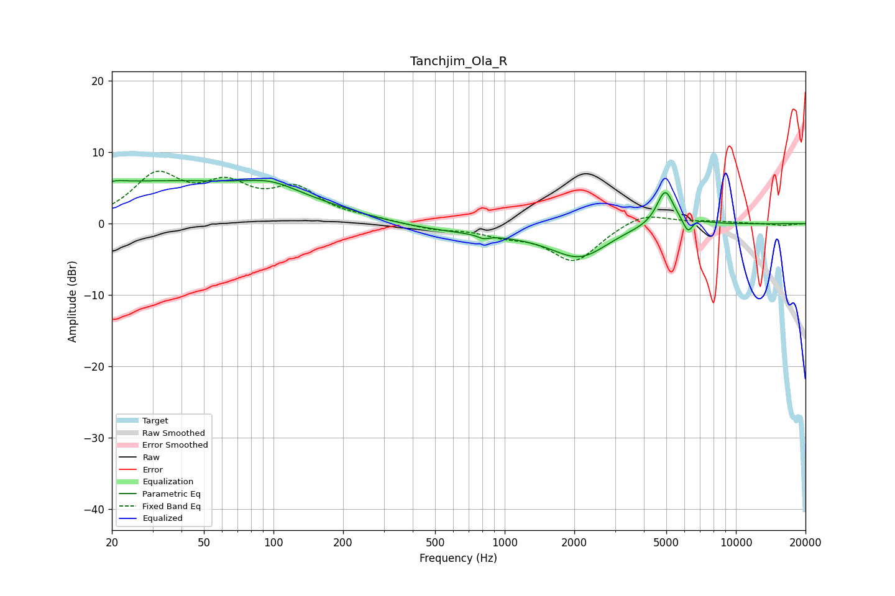

# Tanchjim_Ola_R
See [usage instructions](https://github.com/jaakkopasanen/AutoEq#usage) for more options and info.

### Parametric EQs
Apply preamp of -6.1 dB when using parametric equalizer.

|   # | Type    |   Fc (Hz) |    Q |   Gain (dB) |
|-----|---------|-----------|------|-------------|
|   1 | Peaking |        21 | 4.14 |         0.3 |
|   2 | Peaking |        33 | 0.18 |         5.9 |
|   3 | Peaking |        98 | 1.33 |         1.3 |
|   4 | Peaking |       810 | 5.9  |        -0.5 |
|   5 | Peaking |       871 | 0.27 |        -1.5 |
|   6 | Peaking |      2130 | 1.18 |        -3.9 |
|   7 | Peaking |      3420 | 0.89 |         0.6 |
|   8 | Peaking |      4939 | 3.83 |         5   |
|   9 | Peaking |      6208 | 6    |        -2.4 |
|  10 | Peaking |      6438 | 2.55 |         0.9 |

### Fixed Band EQs
When using fixed band (also called graphic) equalizer, apply preamp of **-7.4 dB** (if available) and set gains manually with these parameters.

|   # | Type    |   Fc (Hz) |    Q |   Gain (dB) |
|-----|---------|-----------|------|-------------|
|   1 | Peaking |        31 | 1.41 |         6.3 |
|   2 | Peaking |        62 | 1.41 |         4.5 |
|   3 | Peaking |       125 | 1.41 |         4.3 |
|   4 | Peaking |       250 | 1.41 |         0.5 |
|   5 | Peaking |       500 | 1.41 |        -0.7 |
|   6 | Peaking |      1000 | 1.41 |        -1.3 |
|   7 | Peaking |      2000 | 1.41 |        -5.2 |
|   8 | Peaking |      4000 | 1.41 |         1.7 |
|   9 | Peaking |      8000 | 1.41 |         0.3 |
|  10 | Peaking |     16000 | 1.41 |        -0.3 |

### Graphs

