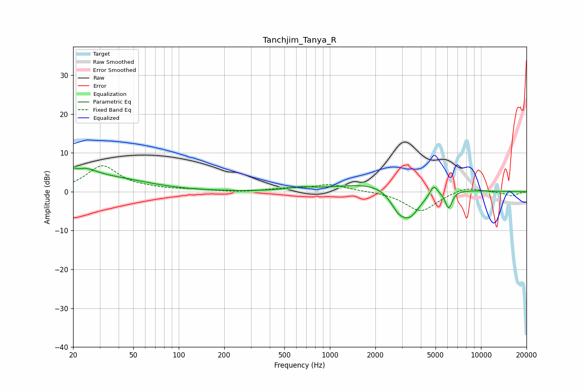

# Tanchjim_Tanya_R
See [usage instructions](https://github.com/jaakkopasanen/AutoEq#usage) for more options and info.

### Parametric EQs
Apply preamp of -6.2 dB when using parametric equalizer.

|   # | Type    |   Fc (Hz) |    Q |   Gain (dB) |
|-----|---------|-----------|------|-------------|
|   1 | Peaking |        21 | 1.22 |         5.3 |
|   2 | Peaking |        22 | 5.75 |        -3.9 |
|   3 | Peaking |        22 | 5.86 |         3.1 |
|   4 | Peaking |        41 | 0.61 |         2.4 |
|   5 | Peaking |       632 | 1.94 |         0.7 |
|   6 | Peaking |      2609 | 0.53 |         3.6 |
|   7 | Peaking |      2820 | 2.74 |        -3.2 |
|   8 | Peaking |      3366 | 1.68 |        -8.4 |
|   9 | Peaking |      4865 | 5.82 |         2.6 |
|  10 | Peaking |      6110 | 6    |        -4.5 |

### Fixed Band EQs
When using fixed band (also called graphic) equalizer, apply preamp of **-6.8 dB** (if available) and set gains manually with these parameters.

|   # | Type    |   Fc (Hz) |    Q |   Gain (dB) |
|-----|---------|-----------|------|-------------|
|   1 | Peaking |        31 | 1.41 |         6.5 |
|   2 | Peaking |        62 | 1.41 |         0.5 |
|   3 | Peaking |       125 | 1.41 |         0.5 |
|   4 | Peaking |       250 | 1.41 |        -0.2 |
|   5 | Peaking |       500 | 1.41 |         0.7 |
|   6 | Peaking |      1000 | 1.41 |         1.8 |
|   7 | Peaking |      2000 | 1.41 |         0.1 |
|   8 | Peaking |      4000 | 1.41 |        -5.1 |
|   9 | Peaking |      8000 | 1.41 |         1.4 |
|  10 | Peaking |     16000 | 1.41 |        -1.1 |

### Graphs

