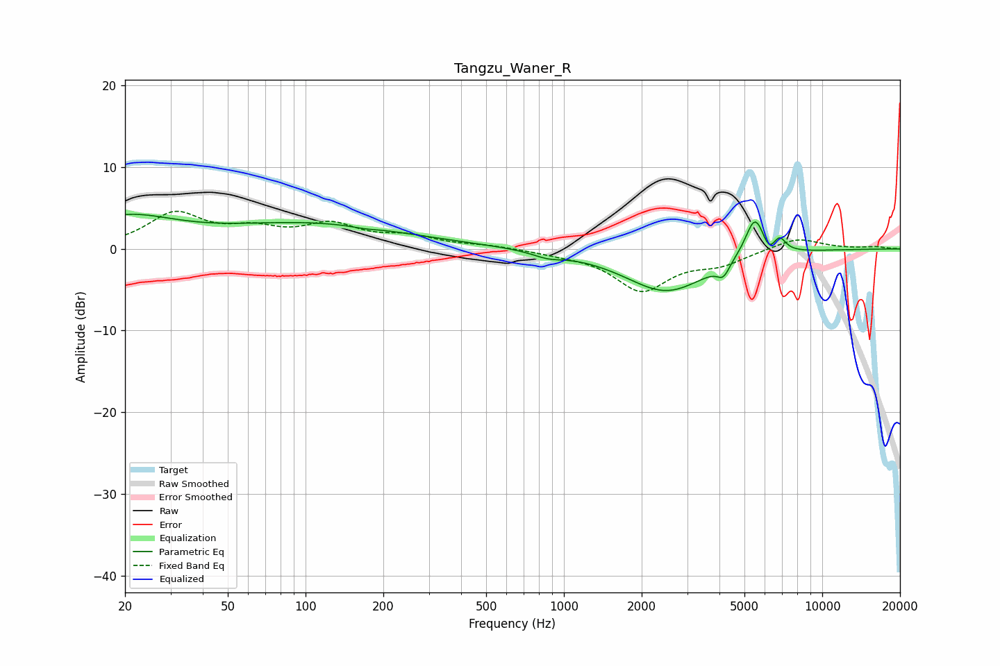

# Tangzu_Waner_R
See [usage instructions](https://github.com/jaakkopasanen/AutoEq#usage) for more options and info.

### Parametric EQs
Apply preamp of -4.3 dB when using parametric equalizer.

|   # | Type    |   Fc (Hz) |    Q |   Gain (dB) |
|-----|---------|-----------|------|-------------|
|   1 | Peaking |        20 | 0.73 |         3.6 |
|   2 | Peaking |       105 | 0.4  |         2.8 |
|   3 | Peaking |       169 | 3.12 |        -0.2 |
|   4 | Peaking |       206 | 0.23 |         0.2 |
|   5 | Peaking |       865 | 2.35 |        -0.7 |
|   6 | Peaking |      2492 | 0.87 |        -5.2 |
|   7 | Peaking |      4144 | 6    |        -1.5 |
|   8 | Peaking |      5490 | 3.67 |         5   |
|   9 | Peaking |      6211 | 5.99 |        -1.3 |
|  10 | Peaking |      6844 | 5.81 |         1.6 |

### Fixed Band EQs
When using fixed band (also called graphic) equalizer, apply preamp of **-4.7 dB** (if available) and set gains manually with these parameters.

|   # | Type    |   Fc (Hz) |    Q |   Gain (dB) |
|-----|---------|-----------|------|-------------|
|   1 | Peaking |        31 | 1.41 |         4.1 |
|   2 | Peaking |        62 | 1.41 |         1.9 |
|   3 | Peaking |       125 | 1.41 |         2.6 |
|   4 | Peaking |       250 | 1.41 |         1.3 |
|   5 | Peaking |       500 | 1.41 |         0.4 |
|   6 | Peaking |      1000 | 1.41 |        -0.4 |
|   7 | Peaking |      2000 | 1.41 |        -4.9 |
|   8 | Peaking |      4000 | 1.41 |        -1.6 |
|   9 | Peaking |      8000 | 1.41 |         1.4 |
|  10 | Peaking |     16000 | 1.41 |         0.2 |

### Graphs

