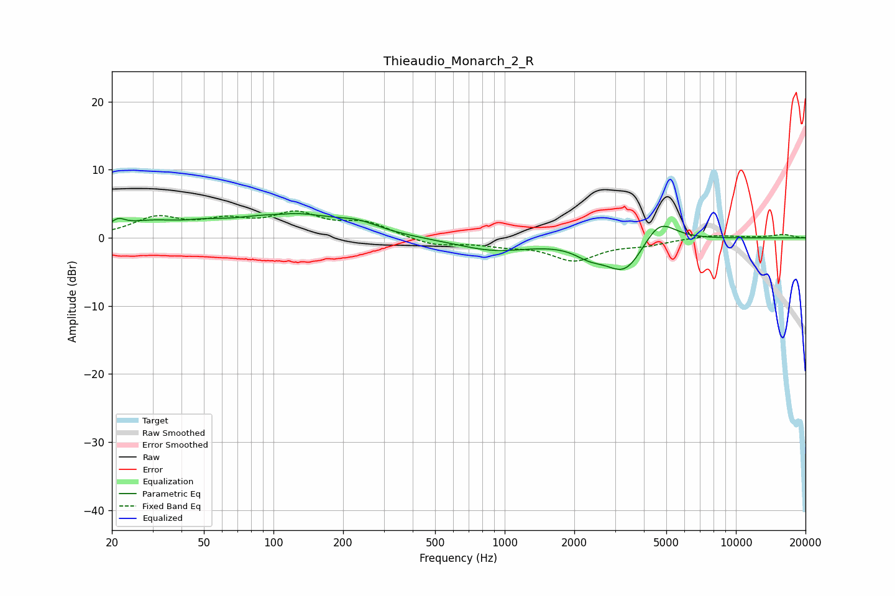

# Thieaudio_Monarch_2_R
See [usage instructions](https://github.com/jaakkopasanen/AutoEq#usage) for more options and info.

### Parametric EQs
Apply preamp of -3.7 dB when using parametric equalizer.

|   # | Type    |   Fc (Hz) |    Q |   Gain (dB) |
|-----|---------|-----------|------|-------------|
|   1 | Peaking |        21 | 4.54 |         1.3 |
|   2 | Peaking |        29 | 1.08 |         1.8 |
|   3 | Peaking |        50 | 1.51 |         0.8 |
|   4 | Peaking |       106 | 1.87 |        -0.6 |
|   5 | Peaking |       112 | 0.75 |         3.7 |
|   6 | Peaking |       232 | 1.48 |         1.3 |
|   7 | Peaking |       898 | 0.87 |        -1.8 |
|   8 | Peaking |      2325 | 2.2  |        -1.5 |
|   9 | Peaking |      3320 | 1.66 |        -5.1 |
|  10 | Peaking |      4641 | 1.98 |         3.8 |

### Fixed Band EQs
When using fixed band (also called graphic) equalizer, apply preamp of **-4.0 dB** (if available) and set gains manually with these parameters.

|   # | Type    |   Fc (Hz) |    Q |   Gain (dB) |
|-----|---------|-----------|------|-------------|
|   1 | Peaking |        31 | 1.41 |         2.7 |
|   2 | Peaking |        62 | 1.41 |         2   |
|   3 | Peaking |       125 | 1.41 |         3.2 |
|   4 | Peaking |       250 | 1.41 |         2   |
|   5 | Peaking |       500 | 1.41 |        -1.2 |
|   6 | Peaking |      1000 | 1.41 |        -0.8 |
|   7 | Peaking |      2000 | 1.41 |        -3.1 |
|   8 | Peaking |      4000 | 1.41 |        -0.8 |
|   9 | Peaking |      8000 | 1.41 |         0.5 |
|  10 | Peaking |     16000 | 1.41 |         0.5 |

### Graphs

