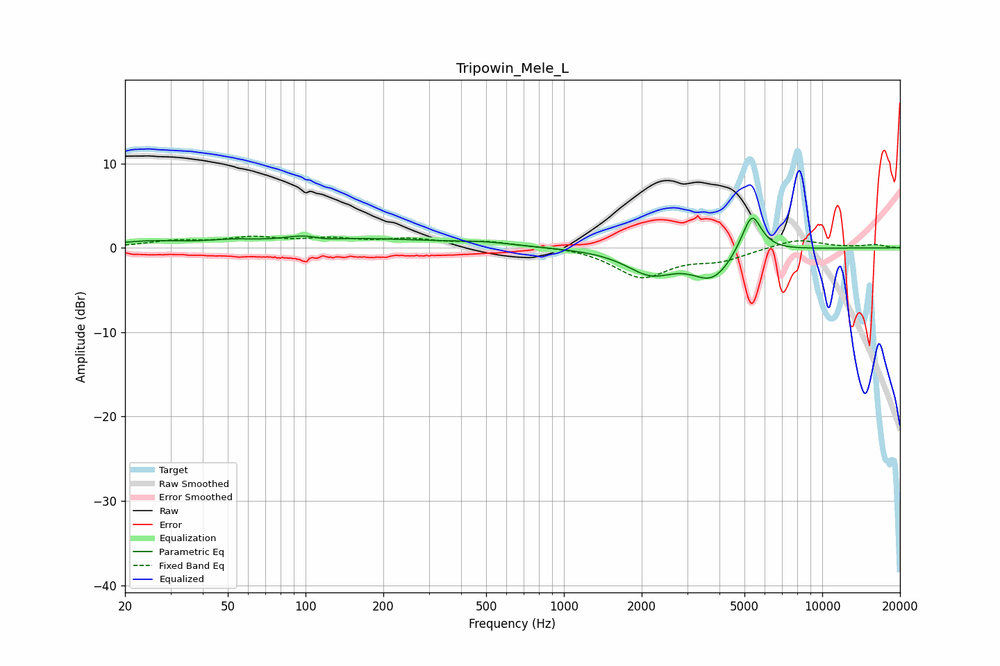

# Tripowin_Mele_L
See [usage instructions](https://github.com/jaakkopasanen/AutoEq#usage) for more options and info.

### Parametric EQs
Apply preamp of -3.6 dB when using parametric equalizer.

|   # | Type    |   Fc (Hz) |    Q |   Gain (dB) |
|-----|---------|-----------|------|-------------|
|   1 | Peaking |        25 | 1.02 |         0.7 |
|   2 | Peaking |        52 | 1.33 |         0.6 |
|   3 | Peaking |       107 | 1.65 |         1.4 |
|   4 | Peaking |       115 | 2.21 |        -1   |
|   5 | Peaking |       192 | 0.56 |         0.9 |
|   6 | Peaking |       493 | 1.16 |         0.4 |
|   7 | Peaking |      2165 | 1.49 |        -2.8 |
|   8 | Peaking |      3757 | 1.78 |        -3.4 |
|   9 | Peaking |      5311 | 3.29 |         4.3 |
|  10 | Peaking |      5404 | 5.88 |         0.6 |

### Fixed Band EQs
When using fixed band (also called graphic) equalizer, apply preamp of **-1.5 dB** (if available) and set gains manually with these parameters.

|   # | Type    |   Fc (Hz) |    Q |   Gain (dB) |
|-----|---------|-----------|------|-------------|
|   1 | Peaking |        31 | 1.41 |         0.7 |
|   2 | Peaking |        62 | 1.41 |         1.1 |
|   3 | Peaking |       125 | 1.41 |         0.9 |
|   4 | Peaking |       250 | 1.41 |         0.9 |
|   5 | Peaking |       500 | 1.41 |         0.6 |
|   6 | Peaking |      1000 | 1.41 |         0.2 |
|   7 | Peaking |      2000 | 1.41 |        -3.4 |
|   8 | Peaking |      4000 | 1.41 |        -1.3 |
|   9 | Peaking |      8000 | 1.41 |         1.1 |
|  10 | Peaking |     16000 | 1.41 |         0.4 |

### Graphs

