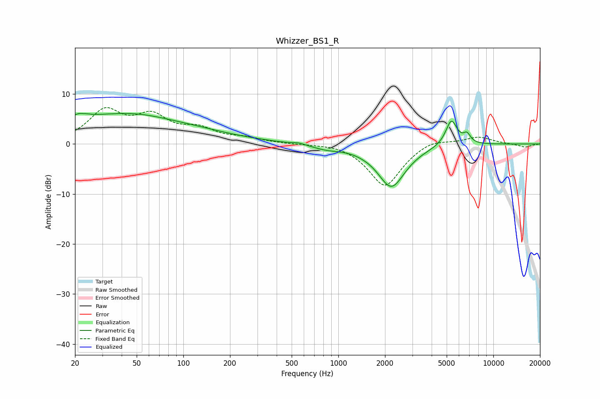

# Whizzer_BS1_R
See [usage instructions](https://github.com/jaakkopasanen/AutoEq#usage) for more options and info.

### Parametric EQs
Apply preamp of -6.2 dB when using parametric equalizer.

|   # | Type    |   Fc (Hz) |    Q |   Gain (dB) |
|-----|---------|-----------|------|-------------|
|   1 | Peaking |        22 | 5.33 |         3.6 |
|   2 | Peaking |        22 | 5.9  |        -3   |
|   3 | Peaking |        29 | 0.18 |         5.2 |
|   4 | Peaking |        48 | 0.76 |         1.1 |
|   5 | Peaking |       556 | 3.97 |         0.3 |
|   6 | Peaking |       845 | 1.53 |        -0.8 |
|   7 | Peaking |      1424 | 2.6  |        -0.1 |
|   8 | Peaking |      2199 | 1.56 |        -8.5 |
|   9 | Peaking |      5362 | 3.74 |         5.2 |
|  10 | Peaking |      6758 | 5.88 |         1.7 |

### Fixed Band EQs
When using fixed band (also called graphic) equalizer, apply preamp of **-7.4 dB** (if available) and set gains manually with these parameters.

|   # | Type    |   Fc (Hz) |    Q |   Gain (dB) |
|-----|---------|-----------|------|-------------|
|   1 | Peaking |        31 | 1.41 |         6.2 |
|   2 | Peaking |        62 | 1.41 |         4.8 |
|   3 | Peaking |       125 | 1.41 |         2.5 |
|   4 | Peaking |       250 | 1.41 |         1   |
|   5 | Peaking |       500 | 1.41 |        -0   |
|   6 | Peaking |      1000 | 1.41 |         0.4 |
|   7 | Peaking |      2000 | 1.41 |        -8.5 |
|   8 | Peaking |      4000 | 1.41 |         1.3 |
|   9 | Peaking |      8000 | 1.41 |         1.5 |
|  10 | Peaking |     16000 | 1.41 |        -0.7 |

### Graphs

