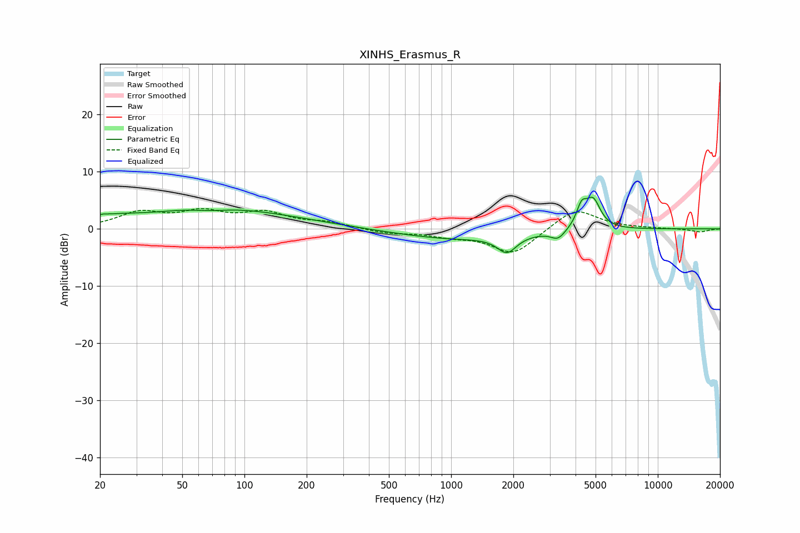

# XINHS_Erasmus_R
See [usage instructions](https://github.com/jaakkopasanen/AutoEq#usage) for more options and info.

### Parametric EQs
Apply preamp of -5.6 dB when using parametric equalizer.

|   # | Type    |   Fc (Hz) |    Q |   Gain (dB) |
|-----|---------|-----------|------|-------------|
|   1 | Peaking |        20 | 5.96 |         0.4 |
|   2 | Peaking |        23 | 1.21 |         1.2 |
|   3 | Peaking |        67 | 0.49 |         3.4 |
|   4 | Peaking |        69 | 1.61 |        -0.6 |
|   5 | Peaking |       172 | 0.55 |         0.8 |
|   6 | Peaking |      1048 | 0.5  |        -1.7 |
|   7 | Peaking |      1863 | 3.07 |        -3   |
|   8 | Peaking |      3292 | 4.18 |        -1.6 |
|   9 | Peaking |      4279 | 5.58 |         3.4 |
|  10 | Peaking |      4869 | 3.96 |         4.9 |

### Fixed Band EQs
When using fixed band (also called graphic) equalizer, apply preamp of **-3.7 dB** (if available) and set gains manually with these parameters.

|   # | Type    |   Fc (Hz) |    Q |   Gain (dB) |
|-----|---------|-----------|------|-------------|
|   1 | Peaking |        31 | 1.41 |         2.6 |
|   2 | Peaking |        62 | 1.41 |         2.6 |
|   3 | Peaking |       125 | 1.41 |         2.5 |
|   4 | Peaking |       250 | 1.41 |         1   |
|   5 | Peaking |       500 | 1.41 |        -0.7 |
|   6 | Peaking |      1000 | 1.41 |        -1   |
|   7 | Peaking |      2000 | 1.41 |        -4.4 |
|   8 | Peaking |      4000 | 1.41 |         3.7 |
|   9 | Peaking |      8000 | 1.41 |         0.1 |
|  10 | Peaking |     16000 | 1.41 |        -0.6 |

### Graphs

