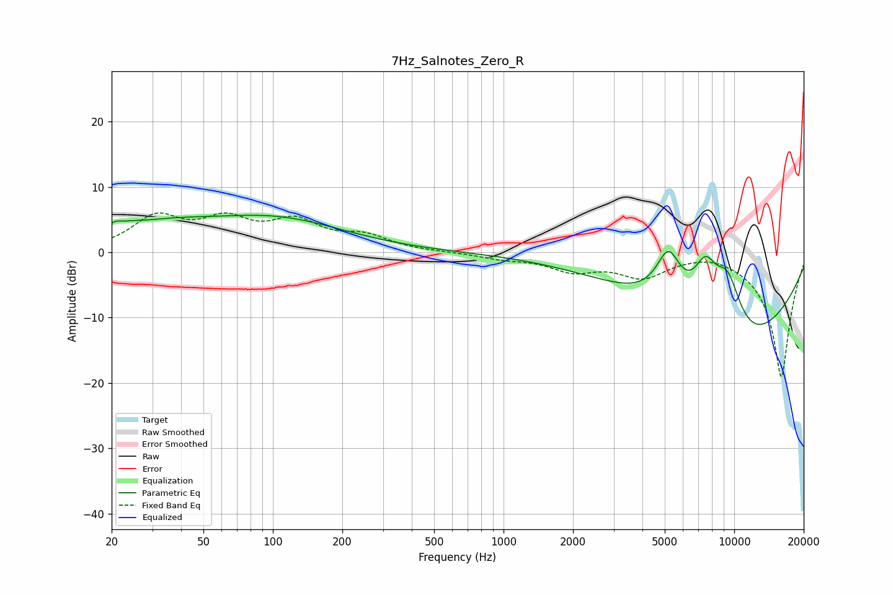

# 7Hz_Salnotes_Zero_R
See [usage instructions](https://github.com/jaakkopasanen/AutoEq#usage) for more options and info.

### Parametric EQs
Apply preamp of -5.8 dB when using parametric equalizer.

|   # | Type    |   Fc (Hz) |    Q |   Gain (dB) |
|-----|---------|-----------|------|-------------|
|   1 | Peaking |        20 | 4.68 |         1.2 |
|   2 | Peaking |        24 | 1.91 |         1.4 |
|   3 | Peaking |        24 | 1.69 |        -0.3 |
|   4 | Peaking |        30 | 0.87 |         1.3 |
|   5 | Peaking |        39 | 0.65 |         1.9 |
|   6 | Peaking |       105 | 0.48 |         4.7 |
|   7 | Peaking |      5183 | 2.49 |         7.8 |
|   8 | Peaking |      7496 | 2.55 |         6.8 |
|   9 | Peaking |      9375 | 1.55 |        12.5 |
|  10 | Peaking |     10000 | 0.42 |       -18.4 |

### Fixed Band EQs
When using fixed band (also called graphic) equalizer, apply preamp of **-6.1 dB** (if available) and set gains manually with these parameters.

|   # | Type    |   Fc (Hz) |    Q |   Gain (dB) |
|-----|---------|-----------|------|-------------|
|   1 | Peaking |        31 | 1.41 |         5   |
|   2 | Peaking |        62 | 1.41 |         4.2 |
|   3 | Peaking |       125 | 1.41 |         4.2 |
|   4 | Peaking |       250 | 1.41 |         2.1 |
|   5 | Peaking |       500 | 1.41 |         0   |
|   6 | Peaking |      1000 | 1.41 |        -0.8 |
|   7 | Peaking |      2000 | 1.41 |        -2.5 |
|   8 | Peaking |      4000 | 1.41 |        -3.4 |
|   9 | Peaking |      8000 | 1.41 |         0.6 |
|  10 | Peaking |     16000 | 1.41 |       -19.2 |

### Graphs

