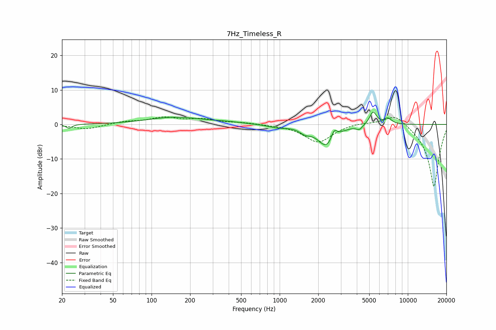

# 7Hz_Timeless_R
See [usage instructions](https://github.com/jaakkopasanen/AutoEq#usage) for more options and info.

### Parametric EQs
Apply preamp of -3.7 dB when using parametric equalizer.

|   # | Type    |   Fc (Hz) |    Q |   Gain (dB) |
|-----|---------|-----------|------|-------------|
|   1 | Peaking |        23 | 5.94 |        -1.2 |
|   2 | Peaking |       154 | 0.67 |         2.1 |
|   3 | Peaking |       392 | 1.25 |         0.4 |
|   4 | Peaking |       962 | 2.06 |        -0.8 |
|   5 | Peaking |      1575 | 3.33 |        -1.4 |
|   6 | Peaking |      2329 | 2.05 |        -6.4 |
|   7 | Peaking |      2658 | 6    |         3   |
|   8 | Peaking |      4187 | 6    |        -1.2 |
|   9 | Peaking |      5354 | 5.05 |         3.9 |
|  10 | Peaking |      6991 | 4.36 |         1.7 |

### Fixed Band EQs
When using fixed band (also called graphic) equalizer, apply preamp of **-2.3 dB** (if available) and set gains manually with these parameters.

|   # | Type    |   Fc (Hz) |    Q |   Gain (dB) |
|-----|---------|-----------|------|-------------|
|   1 | Peaking |        31 | 1.41 |        -1.4 |
|   2 | Peaking |        62 | 1.41 |         0.8 |
|   3 | Peaking |       125 | 1.41 |         1.8 |
|   4 | Peaking |       250 | 1.41 |         1.3 |
|   5 | Peaking |       500 | 1.41 |         0.5 |
|   6 | Peaking |      1000 | 1.41 |        -0.1 |
|   7 | Peaking |      2000 | 1.41 |        -5.2 |
|   8 | Peaking |      4000 | 1.41 |         0.6 |
|   9 | Peaking |      8000 | 1.41 |         3.5 |
|  10 | Peaking |     16000 | 1.41 |       -18.3 |

### Graphs

