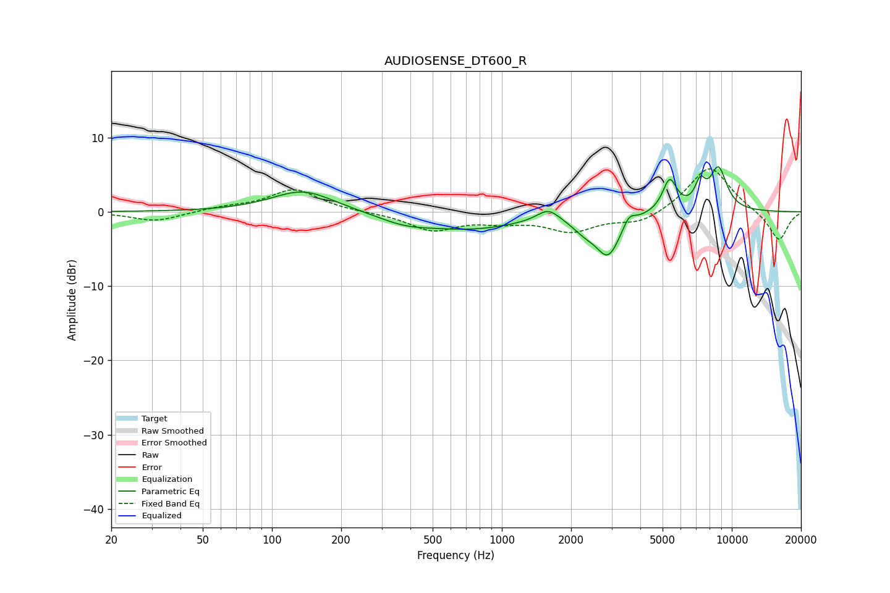

# AUDIOSENSE_DT600_R
See [usage instructions](https://github.com/jaakkopasanen/AutoEq#usage) for more options and info.

### Parametric EQs
Apply preamp of -6.2 dB when using parametric equalizer.

|   # | Type    |   Fc (Hz) |    Q |   Gain (dB) |
|-----|---------|-----------|------|-------------|
|   1 | Peaking |       137 | 1.04 |         2.9 |
|   2 | Peaking |       378 | 1.24 |        -1.1 |
|   3 | Peaking |       734 | 0.64 |        -2.2 |
|   4 | Peaking |      1590 | 2.92 |         1.7 |
|   5 | Peaking |      2286 | 2.63 |        -1.4 |
|   6 | Peaking |      2900 | 2.64 |        -5.4 |
|   7 | Peaking |      3578 | 5.36 |         1.5 |
|   8 | Peaking |      5370 | 4.47 |         4.3 |
|   9 | Peaking |      7288 | 5.87 |         2.9 |
|  10 | Peaking |      8744 | 3.42 |         5.7 |

### Fixed Band EQs
When using fixed band (also called graphic) equalizer, apply preamp of **-5.9 dB** (if available) and set gains manually with these parameters.

|   # | Type    |   Fc (Hz) |    Q |   Gain (dB) |
|-----|---------|-----------|------|-------------|
|   1 | Peaking |        31 | 1.41 |        -1.3 |
|   2 | Peaking |        62 | 1.41 |         0.5 |
|   3 | Peaking |       125 | 1.41 |         3   |
|   4 | Peaking |       250 | 1.41 |        -0   |
|   5 | Peaking |       500 | 1.41 |        -2.4 |
|   6 | Peaking |      1000 | 1.41 |        -1   |
|   7 | Peaking |      2000 | 1.41 |        -2.4 |
|   8 | Peaking |      4000 | 1.41 |        -1.6 |
|   9 | Peaking |      8000 | 1.41 |         6.3 |
|  10 | Peaking |     16000 | 1.41 |        -4   |

### Graphs

