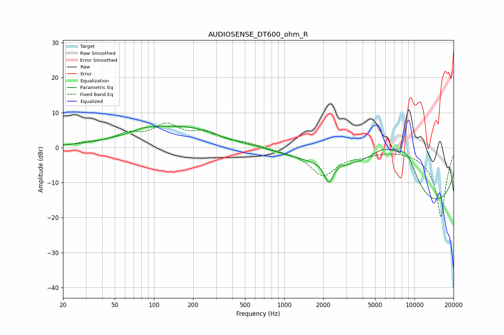

# AUDIOSENSE_DT600_ohm_R
See [usage instructions](https://github.com/jaakkopasanen/AutoEq#usage) for more options and info.

### Parametric EQs
Apply preamp of -6.2 dB when using parametric equalizer.

|   # | Type    |   Fc (Hz) |    Q |   Gain (dB) |
|-----|---------|-----------|------|-------------|
|   1 | Peaking |        39 | 4.5  |        -0   |
|   2 | Peaking |        87 | 1.71 |         1   |
|   3 | Peaking |       174 | 0.33 |         6.2 |
|   4 | Peaking |       198 | 1.15 |         0.5 |
|   5 | Peaking |       359 | 0.74 |        -1.6 |
|   6 | Peaking |      2198 | 4.35 |        -5.8 |
|   7 | Peaking |      3321 | 0.43 |         4   |
|   8 | Peaking |      5897 | 0.89 |        10.4 |
|   9 | Peaking |      8730 | 1.34 |        10.3 |
|  10 | Peaking |     10000 | 0.18 |       -20   |

### Fixed Band EQs
When using fixed band (also called graphic) equalizer, apply preamp of **-7.1 dB** (if available) and set gains manually with these parameters.

|   # | Type    |   Fc (Hz) |    Q |   Gain (dB) |
|-----|---------|-----------|------|-------------|
|   1 | Peaking |        31 | 1.41 |         1   |
|   2 | Peaking |        62 | 1.41 |         3.1 |
|   3 | Peaking |       125 | 1.41 |         5.7 |
|   4 | Peaking |       250 | 1.41 |         3.7 |
|   5 | Peaking |       500 | 1.41 |         1.1 |
|   6 | Peaking |      1000 | 1.41 |        -0.5 |
|   7 | Peaking |      2000 | 1.41 |        -7.7 |
|   8 | Peaking |      4000 | 1.41 |        -1.3 |
|   9 | Peaking |      8000 | 1.41 |         0.1 |
|  10 | Peaking |     16000 | 1.41 |       -20   |

### Graphs

