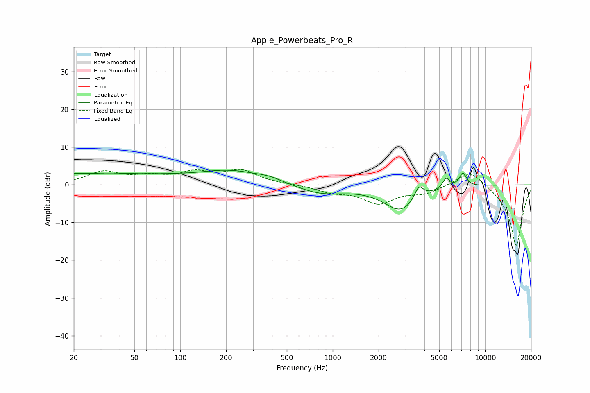

# Apple_Powerbeats_Pro_R
See [usage instructions](https://github.com/jaakkopasanen/AutoEq#usage) for more options and info.

### Parametric EQs
Apply preamp of -4.0 dB when using parametric equalizer.

|   # | Type    |   Fc (Hz) |    Q |   Gain (dB) |
|-----|---------|-----------|------|-------------|
|   1 | Peaking |        20 | 0.81 |         2.2 |
|   2 | Peaking |        57 | 0.6  |         2.1 |
|   3 | Peaking |       213 | 0.66 |         3.5 |
|   4 | Peaking |       386 | 1.7  |         0.9 |
|   5 | Peaking |       840 | 0.89 |        -2.4 |
|   6 | Peaking |      2799 | 1.26 |        -6.6 |
|   7 | Peaking |      3674 | 4.78 |         3.7 |
|   8 | Peaking |      5561 | 6    |         2.7 |
|   9 | Peaking |      7133 | 5.3  |         0.7 |
|  10 | Peaking |      7160 | 5.99 |         2.9 |

### Fixed Band EQs
When using fixed band (also called graphic) equalizer, apply preamp of **-4.2 dB** (if available) and set gains manually with these parameters.

|   # | Type    |   Fc (Hz) |    Q |   Gain (dB) |
|-----|---------|-----------|------|-------------|
|   1 | Peaking |        31 | 1.41 |         3.3 |
|   2 | Peaking |        62 | 1.41 |         1.8 |
|   3 | Peaking |       125 | 1.41 |         2.9 |
|   4 | Peaking |       250 | 1.41 |         3.5 |
|   5 | Peaking |       500 | 1.41 |         0.1 |
|   6 | Peaking |      1000 | 1.41 |        -1.7 |
|   7 | Peaking |      2000 | 1.41 |        -4.6 |
|   8 | Peaking |      4000 | 1.41 |        -2   |
|   9 | Peaking |      8000 | 1.41 |         4.3 |
|  10 | Peaking |     16000 | 1.41 |       -16.4 |

### Graphs

