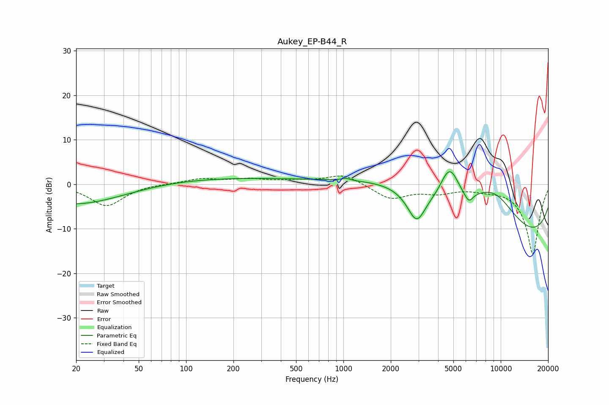

# Aukey_EP-B44_R
See [usage instructions](https://github.com/jaakkopasanen/AutoEq#usage) for more options and info.

### Parametric EQs
Apply preamp of -2.9 dB when using parametric equalizer.

|   # | Type    |   Fc (Hz) |    Q |   Gain (dB) |
|-----|---------|-----------|------|-------------|
|   1 | Peaking |        20 | 0.47 |        -4.6 |
|   2 | Peaking |       167 | 0.29 |         1.4 |
|   3 | Peaking |      1038 | 5.76 |         0.5 |
|   4 | Peaking |      2920 | 2.31 |        -7.7 |
|   5 | Peaking |      3267 | 0.34 |         7.7 |
|   6 | Peaking |      4491 | 3.24 |         2.7 |
|   7 | Peaking |      4889 | 3.08 |         4.1 |
|   8 | Peaking |      6262 | 4.91 |        -2.3 |
|   9 | Peaking |      9077 | 0.76 |         8.9 |
|  10 | Peaking |     10000 | 0.18 |       -15   |

### Fixed Band EQs
When using fixed band (also called graphic) equalizer, apply preamp of **-1.9 dB** (if available) and set gains manually with these parameters.

|   # | Type    |   Fc (Hz) |    Q |   Gain (dB) |
|-----|---------|-----------|------|-------------|
|   1 | Peaking |        31 | 1.41 |        -4.9 |
|   2 | Peaking |        62 | 1.41 |         0.1 |
|   3 | Peaking |       125 | 1.41 |         1.2 |
|   4 | Peaking |       250 | 1.41 |         1   |
|   5 | Peaking |       500 | 1.41 |         0.6 |
|   6 | Peaking |      1000 | 1.41 |         2.3 |
|   7 | Peaking |      2000 | 1.41 |        -3.2 |
|   8 | Peaking |      4000 | 1.41 |        -1.6 |
|   9 | Peaking |      8000 | 1.41 |        -0.7 |
|  10 | Peaking |     16000 | 1.41 |       -15.7 |

### Graphs

