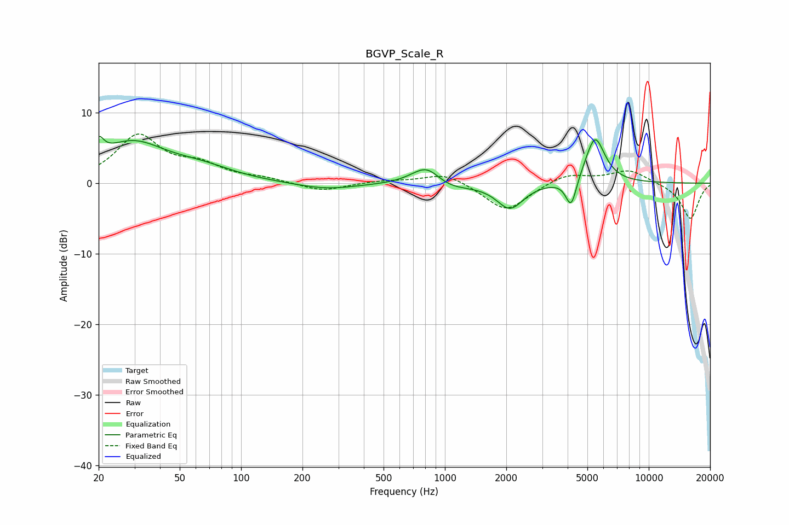

# BGVP_Scale_R
See [usage instructions](https://github.com/jaakkopasanen/AutoEq#usage) for more options and info.

### Parametric EQs
Apply preamp of -6.7 dB when using parametric equalizer.

|   # | Type    |   Fc (Hz) |    Q |   Gain (dB) |
|-----|---------|-----------|------|-------------|
|   1 | Peaking |        20 | 5.79 |         2.5 |
|   2 | Peaking |        29 | 0.83 |         5.5 |
|   3 | Peaking |        65 | 0.89 |         1.5 |
|   4 | Peaking |       262 | 0.97 |        -0.9 |
|   5 | Peaking |       754 | 1.86 |         0.9 |
|   6 | Peaking |       826 | 2.3  |         1.8 |
|   7 | Peaking |      1052 | 1.47 |        -0.9 |
|   8 | Peaking |      2087 | 2.18 |        -3.6 |
|   9 | Peaking |      4164 | 5.26 |        -4.2 |
|  10 | Peaking |      5451 | 2.88 |         6.7 |

### Fixed Band EQs
When using fixed band (also called graphic) equalizer, apply preamp of **-7.1 dB** (if available) and set gains manually with these parameters.

|   # | Type    |   Fc (Hz) |    Q |   Gain (dB) |
|-----|---------|-----------|------|-------------|
|   1 | Peaking |        31 | 1.41 |         6.6 |
|   2 | Peaking |        62 | 1.41 |         2.2 |
|   3 | Peaking |       125 | 1.41 |         0.6 |
|   4 | Peaking |       250 | 1.41 |        -1.2 |
|   5 | Peaking |       500 | 1.41 |         0.3 |
|   6 | Peaking |      1000 | 1.41 |         1.5 |
|   7 | Peaking |      2000 | 1.41 |        -4.1 |
|   8 | Peaking |      4000 | 1.41 |         1.4 |
|   9 | Peaking |      8000 | 1.41 |         1.9 |
|  10 | Peaking |     16000 | 1.41 |        -5.1 |

### Graphs

