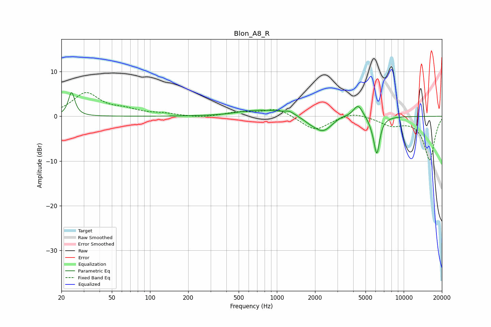

# Blon_A8_R
See [usage instructions](https://github.com/jaakkopasanen/AutoEq#usage) for more options and info.

### Parametric EQs
Apply preamp of -5.4 dB when using parametric equalizer.

|   # | Type    |   Fc (Hz) |    Q |   Gain (dB) |
|-----|---------|-----------|------|-------------|
|   1 | Peaking |        24 | 5.86 |         5.3 |
|   2 | Peaking |       560 | 1.51 |         0.3 |
|   3 | Peaking |       843 | 0.83 |         1.4 |
|   4 | Peaking |      1257 | 3.72 |         0.7 |
|   5 | Peaking |      1805 | 3.02 |        -0.6 |
|   6 | Peaking |      2303 | 1.89 |        -3.5 |
|   7 | Peaking |      3185 | 2.72 |         0.6 |
|   8 | Peaking |      4366 | 3.73 |         2.9 |
|   9 | Peaking |      5684 | 5.05 |        -1   |
|  10 | Peaking |      6144 | 5.98 |        -7.9 |

### Fixed Band EQs
When using fixed band (also called graphic) equalizer, apply preamp of **-5.4 dB** (if available) and set gains manually with these parameters.

|   # | Type    |   Fc (Hz) |    Q |   Gain (dB) |
|-----|---------|-----------|------|-------------|
|   1 | Peaking |        31 | 1.41 |         5.1 |
|   2 | Peaking |        62 | 1.41 |         1.2 |
|   3 | Peaking |       125 | 1.41 |         0.5 |
|   4 | Peaking |       250 | 1.41 |        -0.4 |
|   5 | Peaking |       500 | 1.41 |         0.8 |
|   6 | Peaking |      1000 | 1.41 |         1.8 |
|   7 | Peaking |      2000 | 1.41 |        -3.2 |
|   8 | Peaking |      4000 | 1.41 |         1.1 |
|   9 | Peaking |      8000 | 1.41 |        -1.8 |
|  10 | Peaking |     16000 | 1.41 |        -9.7 |

### Graphs

