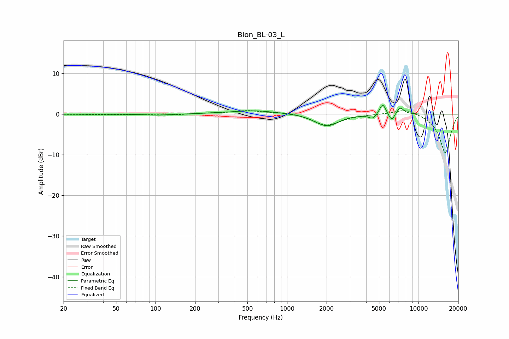

# Blon_BL-03_L
See [usage instructions](https://github.com/jaakkopasanen/AutoEq#usage) for more options and info.

### Parametric EQs
Apply preamp of -2.3 dB when using parametric equalizer.

|   # | Type    |   Fc (Hz) |    Q |   Gain (dB) |
|-----|---------|-----------|------|-------------|
|   1 | Peaking |       103 | 1.67 |        -0.3 |
|   2 | Peaking |       302 | 1.64 |         0.1 |
|   3 | Peaking |       576 | 0.86 |         0.9 |
|   4 | Peaking |      1662 | 2.8  |        -0.3 |
|   5 | Peaking |      2039 | 1.7  |        -2.8 |
|   6 | Peaking |      4473 | 5.08 |        -1.1 |
|   7 | Peaking |      5320 | 6    |         2.2 |
|   8 | Peaking |      5413 | 5.64 |         0.6 |
|   9 | Peaking |      6265 | 5.98 |        -2   |
|  10 | Peaking |      7246 | 4.65 |         1.8 |

### Fixed Band EQs
When using fixed band (also called graphic) equalizer, apply preamp of **-1.0 dB** (if available) and set gains manually with these parameters.

|   # | Type    |   Fc (Hz) |    Q |   Gain (dB) |
|-----|---------|-----------|------|-------------|
|   1 | Peaking |        31 | 1.41 |        -0.1 |
|   2 | Peaking |        62 | 1.41 |        -0.1 |
|   3 | Peaking |       125 | 1.41 |        -0.2 |
|   4 | Peaking |       250 | 1.41 |         0.2 |
|   5 | Peaking |       500 | 1.41 |         0.8 |
|   6 | Peaking |      1000 | 1.41 |         0.5 |
|   7 | Peaking |      2000 | 1.41 |        -2.8 |
|   8 | Peaking |      4000 | 1.41 |        -0   |
|   9 | Peaking |      8000 | 1.41 |         1.5 |
|  10 | Peaking |     16000 | 1.41 |        -9.6 |

### Graphs

