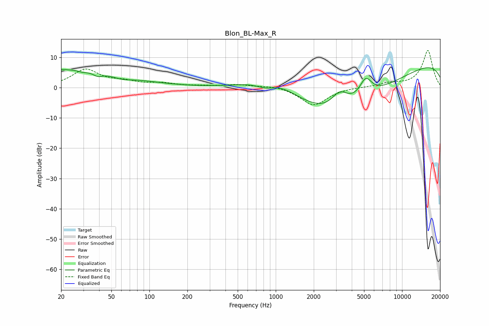

# Blon_BL-Max_R
See [usage instructions](https://github.com/jaakkopasanen/AutoEq#usage) for more options and info.

### Parametric EQs
Apply preamp of -6.7 dB when using parametric equalizer.

|   # | Type    |   Fc (Hz) |    Q |   Gain (dB) |
|-----|---------|-----------|------|-------------|
|   1 | Peaking |        20 | 0.26 |         6.1 |
|   2 | Peaking |        30 | 4.27 |        -0.5 |
|   3 | Peaking |        39 | 4.12 |        -1.2 |
|   4 | Peaking |        61 | 1.73 |        -1.2 |
|   5 | Peaking |       852 | 1.48 |        -4.6 |
|   6 | Peaking |       919 | 0.72 |        10.7 |
|   7 | Peaking |      3106 | 0.33 |       -17.5 |
|   8 | Peaking |      3207 | 1.98 |         6.3 |
|   9 | Peaking |      5154 | 2.76 |         6.3 |
|  10 | Peaking |     10000 | 0.18 |        10.4 |

### Fixed Band EQs
When using fixed band (also called graphic) equalizer, apply preamp of **-12.3 dB** (if available) and set gains manually with these parameters.

|   # | Type    |   Fc (Hz) |    Q |   Gain (dB) |
|-----|---------|-----------|------|-------------|
|   1 | Peaking |        31 | 1.41 |         5.8 |
|   2 | Peaking |        62 | 1.41 |         1.5 |
|   3 | Peaking |       125 | 1.41 |         1.2 |
|   4 | Peaking |       250 | 1.41 |         0.4 |
|   5 | Peaking |       500 | 1.41 |         0.9 |
|   6 | Peaking |      1000 | 1.41 |         0.8 |
|   7 | Peaking |      2000 | 1.41 |        -5.9 |
|   8 | Peaking |      4000 | 1.41 |         0.2 |
|   9 | Peaking |      8000 | 1.41 |         1.2 |
|  10 | Peaking |     16000 | 1.41 |        12.3 |

### Graphs

