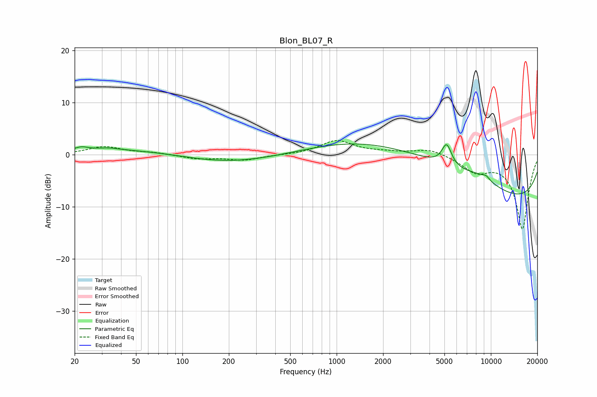

# Blon_BL07_R
See [usage instructions](https://github.com/jaakkopasanen/AutoEq#usage) for more options and info.

### Parametric EQs
Apply preamp of -2.2 dB when using parametric equalizer.

|   # | Type    |   Fc (Hz) |    Q |   Gain (dB) |
|-----|---------|-----------|------|-------------|
|   1 | Peaking |        22 | 2.83 |         0.9 |
|   2 | Peaking |        30 | 1.57 |        -0.4 |
|   3 | Peaking |        32 | 1.75 |         0.8 |
|   4 | Peaking |        56 | 0.4  |         1.2 |
|   5 | Peaking |       183 | 0.43 |        -1.8 |
|   6 | Peaking |      3519 | 0.25 |         8.1 |
|   7 | Peaking |      5168 | 4.42 |         4.1 |
|   8 | Peaking |      8470 | 1.45 |         1.1 |
|   9 | Peaking |      9321 | 0.18 |       -11.1 |
|  10 | Peaking |      9332 | 5.28 |         0.6 |

### Fixed Band EQs
When using fixed band (also called graphic) equalizer, apply preamp of **-2.8 dB** (if available) and set gains manually with these parameters.

|   # | Type    |   Fc (Hz) |    Q |   Gain (dB) |
|-----|---------|-----------|------|-------------|
|   1 | Peaking |        31 | 1.41 |         1.5 |
|   2 | Peaking |        62 | 1.41 |         0.4 |
|   3 | Peaking |       125 | 1.41 |        -0.8 |
|   4 | Peaking |       250 | 1.41 |        -1   |
|   5 | Peaking |       500 | 1.41 |        -0   |
|   6 | Peaking |      1000 | 1.41 |         2.7 |
|   7 | Peaking |      2000 | 1.41 |         0.4 |
|   8 | Peaking |      4000 | 1.41 |         1.2 |
|   9 | Peaking |      8000 | 1.41 |        -2.9 |
|  10 | Peaking |     16000 | 1.41 |       -14.2 |

### Graphs

