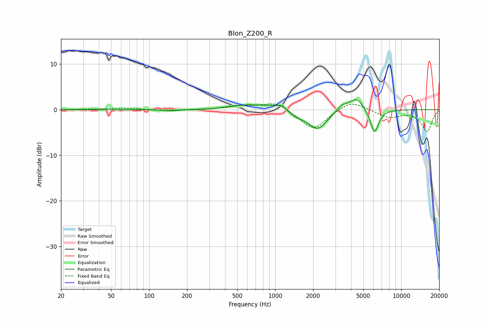

# Blon_Z200_R
See [usage instructions](https://github.com/jaakkopasanen/AutoEq#usage) for more options and info.

### Parametric EQs
Apply preamp of -2.3 dB when using parametric equalizer.

|   # | Type    |   Fc (Hz) |    Q |   Gain (dB) |
|-----|---------|-----------|------|-------------|
|   1 | Peaking |       151 | 2.22 |        -0.3 |
|   2 | Peaking |       580 | 1.3  |         0.7 |
|   3 | Peaking |      1129 | 5.5  |         0.6 |
|   4 | Peaking |      1135 | 0.96 |         1.4 |
|   5 | Peaking |      1444 | 2.03 |        -1.6 |
|   6 | Peaking |      1969 | 2.04 |        -0.5 |
|   7 | Peaking |      2191 | 1.82 |        -4   |
|   8 | Peaking |      3377 | 3.34 |         1.3 |
|   9 | Peaking |      4418 | 2.45 |         2.8 |
|  10 | Peaking |      6132 | 4.12 |        -5.3 |

### Fixed Band EQs
When using fixed band (also called graphic) equalizer, apply preamp of **-1.4 dB** (if available) and set gains manually with these parameters.

|   # | Type    |   Fc (Hz) |    Q |   Gain (dB) |
|-----|---------|-----------|------|-------------|
|   1 | Peaking |        31 | 1.41 |         0   |
|   2 | Peaking |        62 | 1.41 |         0.3 |
|   3 | Peaking |       125 | 1.41 |        -0.2 |
|   4 | Peaking |       250 | 1.41 |        -0.1 |
|   5 | Peaking |       500 | 1.41 |         0.8 |
|   6 | Peaking |      1000 | 1.41 |         1.8 |
|   7 | Peaking |      2000 | 1.41 |        -4.5 |
|   8 | Peaking |      4000 | 1.41 |         2.2 |
|   9 | Peaking |      8000 | 1.41 |        -1.7 |
|  10 | Peaking |     16000 | 1.41 |        -4.8 |

### Graphs

