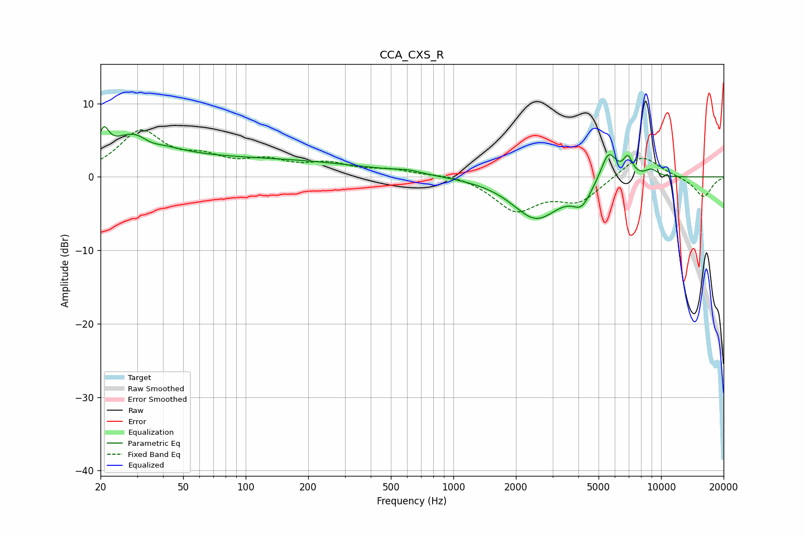

# CCA_CXS_R
See [usage instructions](https://github.com/jaakkopasanen/AutoEq#usage) for more options and info.

### Parametric EQs
Apply preamp of -6.9 dB when using parametric equalizer.

|   # | Type    |   Fc (Hz) |    Q |   Gain (dB) |
|-----|---------|-----------|------|-------------|
|   1 | Peaking |        21 | 5.99 |         3.1 |
|   2 | Peaking |        30 | 1.21 |         4.6 |
|   3 | Peaking |        34 | 2.44 |        -1.4 |
|   4 | Peaking |        89 | 0.21 |         2.4 |
|   5 | Peaking |       607 | 2.29 |         0.4 |
|   6 | Peaking |      2503 | 1.23 |        -5.6 |
|   7 | Peaking |      4151 | 3.12 |        -2.6 |
|   8 | Peaking |      5589 | 3.62 |         4.1 |
|   9 | Peaking |      6929 | 6    |         2.5 |
|  10 | Peaking |      8988 | 4.03 |         1   |

### Fixed Band EQs
When using fixed band (also called graphic) equalizer, apply preamp of **-6.5 dB** (if available) and set gains manually with these parameters.

|   # | Type    |   Fc (Hz) |    Q |   Gain (dB) |
|-----|---------|-----------|------|-------------|
|   1 | Peaking |        31 | 1.41 |         6   |
|   2 | Peaking |        62 | 1.41 |         2   |
|   3 | Peaking |       125 | 1.41 |         1.8 |
|   4 | Peaking |       250 | 1.41 |         1.5 |
|   5 | Peaking |       500 | 1.41 |         0.8 |
|   6 | Peaking |      1000 | 1.41 |         0.5 |
|   7 | Peaking |      2000 | 1.41 |        -4.4 |
|   8 | Peaking |      4000 | 1.41 |        -3.2 |
|   9 | Peaking |      8000 | 1.41 |         3.2 |
|  10 | Peaking |     16000 | 1.41 |        -2.8 |

### Graphs

