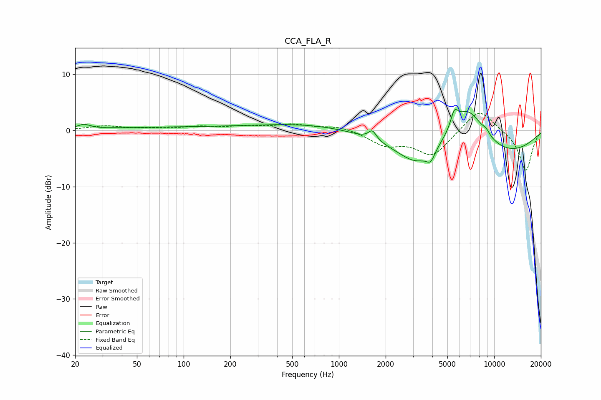

# CCA_FLA_R
See [usage instructions](https://github.com/jaakkopasanen/AutoEq#usage) for more options and info.

### Parametric EQs
Apply preamp of -3.9 dB when using parametric equalizer.

|   # | Type    |   Fc (Hz) |    Q |   Gain (dB) |
|-----|---------|-----------|------|-------------|
|   1 | Peaking |        23 | 3.52 |         0.8 |
|   2 | Peaking |       113 | 0.22 |         0.6 |
|   3 | Peaking |      1644 | 5.48 |         1.7 |
|   4 | Peaking |      1906 | 0.22 |         2.2 |
|   5 | Peaking |      3177 | 1.26 |        -3.2 |
|   6 | Peaking |      3904 | 5.34 |        -1.8 |
|   7 | Peaking |      5541 | 5.91 |         2.7 |
|   8 | Peaking |      6211 | 0.26 |        -7.4 |
|   9 | Peaking |      6706 | 1.07 |         9.5 |
|  10 | Peaking |      8882 | 6    |         0.7 |

### Fixed Band EQs
When using fixed band (also called graphic) equalizer, apply preamp of **-3.1 dB** (if available) and set gains manually with these parameters.

|   # | Type    |   Fc (Hz) |    Q |   Gain (dB) |
|-----|---------|-----------|------|-------------|
|   1 | Peaking |        31 | 1.41 |         0.8 |
|   2 | Peaking |        62 | 1.41 |         0.2 |
|   3 | Peaking |       125 | 1.41 |         0.6 |
|   4 | Peaking |       250 | 1.41 |         0.6 |
|   5 | Peaking |       500 | 1.41 |         1   |
|   6 | Peaking |      1000 | 1.41 |         0.8 |
|   7 | Peaking |      2000 | 1.41 |        -2.4 |
|   8 | Peaking |      4000 | 1.41 |        -4.4 |
|   9 | Peaking |      8000 | 1.41 |         4.1 |
|  10 | Peaking |     16000 | 1.41 |        -7.3 |

### Graphs

