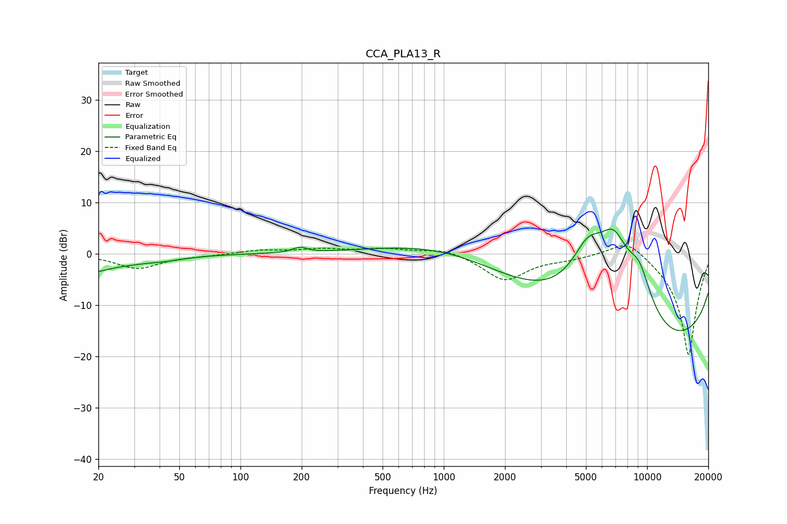

# CCA_PLA13_R
See [usage instructions](https://github.com/jaakkopasanen/AutoEq#usage) for more options and info.

### Parametric EQs
Apply preamp of -4.9 dB when using parametric equalizer.

|   # | Type    |   Fc (Hz) |    Q |   Gain (dB) |
|-----|---------|-----------|------|-------------|
|   1 | Peaking |        20 | 0.99 |        -4.3 |
|   2 | Peaking |        23 | 1.77 |         1.1 |
|   3 | Peaking |        43 | 1.52 |        -0.6 |
|   4 | Peaking |       194 | 6    |        -1.3 |
|   5 | Peaking |       195 | 5.04 |         2.3 |
|   6 | Peaking |      1143 | 0.44 |         4.6 |
|   7 | Peaking |      5111 | 1.58 |         8.8 |
|   8 | Peaking |      6852 | 1.2  |        16.1 |
|   9 | Peaking |      9152 | 1.94 |         7.8 |
|  10 | Peaking |     10000 | 0.18 |       -20   |

### Fixed Band EQs
When using fixed band (also called graphic) equalizer, apply preamp of **-1.6 dB** (if available) and set gains manually with these parameters.

|   # | Type    |   Fc (Hz) |    Q |   Gain (dB) |
|-----|---------|-----------|------|-------------|
|   1 | Peaking |        31 | 1.41 |        -2.8 |
|   2 | Peaking |        62 | 1.41 |        -0.3 |
|   3 | Peaking |       125 | 1.41 |         0.7 |
|   4 | Peaking |       250 | 1.41 |         0.8 |
|   5 | Peaking |       500 | 1.41 |         0.9 |
|   6 | Peaking |      1000 | 1.41 |         1.2 |
|   7 | Peaking |      2000 | 1.41 |        -5.2 |
|   8 | Peaking |      4000 | 1.41 |        -0.7 |
|   9 | Peaking |      8000 | 1.41 |         3.5 |
|  10 | Peaking |     16000 | 1.41 |       -20   |

### Graphs

