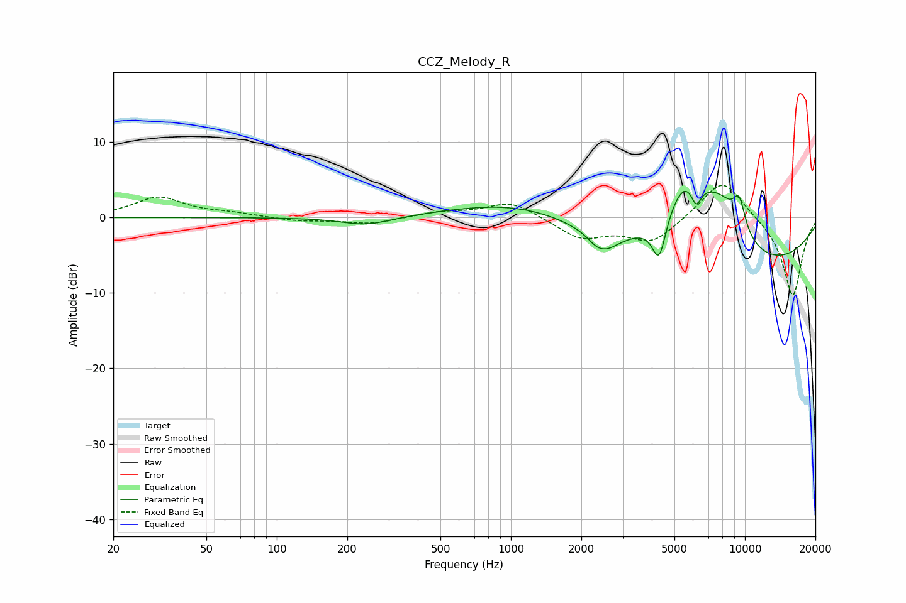

# CCZ_Melody_R
See [usage instructions](https://github.com/jaakkopasanen/AutoEq#usage) for more options and info.

### Parametric EQs
Apply preamp of -3.6 dB when using parametric equalizer.

|   # | Type    |   Fc (Hz) |    Q |   Gain (dB) |
|-----|---------|-----------|------|-------------|
|   1 | Peaking |       242 | 1.3  |        -1.2 |
|   2 | Peaking |      1172 | 0.5  |         2.8 |
|   3 | Peaking |      2294 | 4.66 |        -0.5 |
|   4 | Peaking |      2514 | 2.36 |        -2.3 |
|   5 | Peaking |      4300 | 4.64 |        -5.8 |
|   6 | Peaking |      5601 | 1.26 |         9.9 |
|   7 | Peaking |      6185 | 6    |        -3   |
|   8 | Peaking |      7856 | 1.39 |         5.6 |
|   9 | Peaking |      7998 | 0.23 |        -7.8 |
|  10 | Peaking |      9455 | 4.78 |         4   |

### Fixed Band EQs
When using fixed band (also called graphic) equalizer, apply preamp of **-4.4 dB** (if available) and set gains manually with these parameters.

|   # | Type    |   Fc (Hz) |    Q |   Gain (dB) |
|-----|---------|-----------|------|-------------|
|   1 | Peaking |        31 | 1.41 |         2.7 |
|   2 | Peaking |        62 | 1.41 |         0.5 |
|   3 | Peaking |       125 | 1.41 |        -0.5 |
|   4 | Peaking |       250 | 1.41 |        -0.8 |
|   5 | Peaking |       500 | 1.41 |         0.7 |
|   6 | Peaking |      1000 | 1.41 |         2.2 |
|   7 | Peaking |      2000 | 1.41 |        -2.7 |
|   8 | Peaking |      4000 | 1.41 |        -3.3 |
|   9 | Peaking |      8000 | 1.41 |         5.4 |
|  10 | Peaking |     16000 | 1.41 |       -10.6 |

### Graphs

