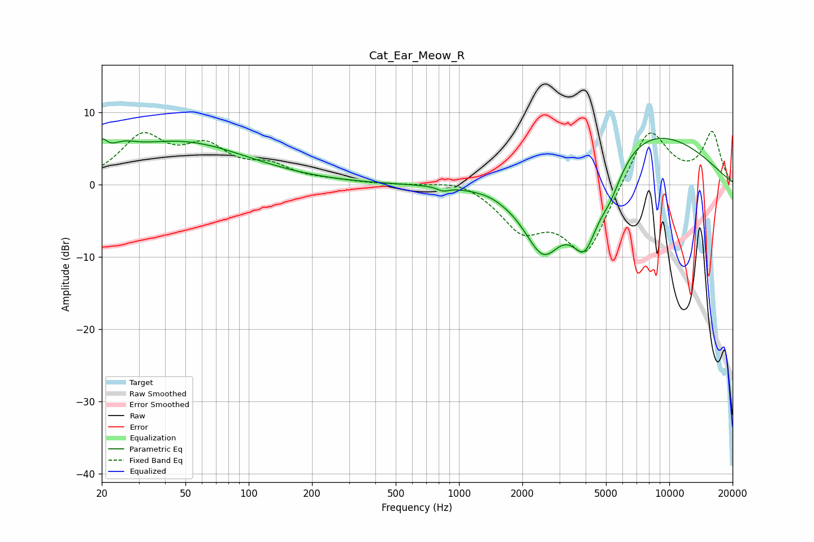

# Cat_Ear_Meow_R
See [usage instructions](https://github.com/jaakkopasanen/AutoEq#usage) for more options and info.

### Parametric EQs
Apply preamp of -6.5 dB when using parametric equalizer.

|   # | Type    |   Fc (Hz) |    Q |   Gain (dB) |
|-----|---------|-----------|------|-------------|
|   1 | Peaking |        20 | 5.89 |         2.2 |
|   2 | Peaking |        25 | 2.24 |         1.4 |
|   3 | Peaking |        47 | 0.43 |         5.9 |
|   4 | Peaking |       831 | 4.27 |         0.3 |
|   5 | Peaking |       838 | 4.94 |        -0.8 |
|   6 | Peaking |      1378 | 2.59 |         0.2 |
|   7 | Peaking |      2516 | 1.3  |       -11.2 |
|   8 | Peaking |      3965 | 1.94 |       -10   |
|   9 | Peaking |      5242 | 2.32 |        -3.7 |
|  10 | Peaking |      7067 | 0.37 |         8.4 |

### Fixed Band EQs
When using fixed band (also called graphic) equalizer, apply preamp of **-7.5 dB** (if available) and set gains manually with these parameters.

|   # | Type    |   Fc (Hz) |    Q |   Gain (dB) |
|-----|---------|-----------|------|-------------|
|   1 | Peaking |        31 | 1.41 |         6.3 |
|   2 | Peaking |        62 | 1.41 |         4.5 |
|   3 | Peaking |       125 | 1.41 |         2.2 |
|   4 | Peaking |       250 | 1.41 |         0.4 |
|   5 | Peaking |       500 | 1.41 |         0   |
|   6 | Peaking |      1000 | 1.41 |         1   |
|   7 | Peaking |      2000 | 1.41 |        -5.5 |
|   8 | Peaking |      4000 | 1.41 |        -9.7 |
|   9 | Peaking |      8000 | 1.41 |         8.4 |
|  10 | Peaking |     16000 | 1.41 |         7.1 |

### Graphs

