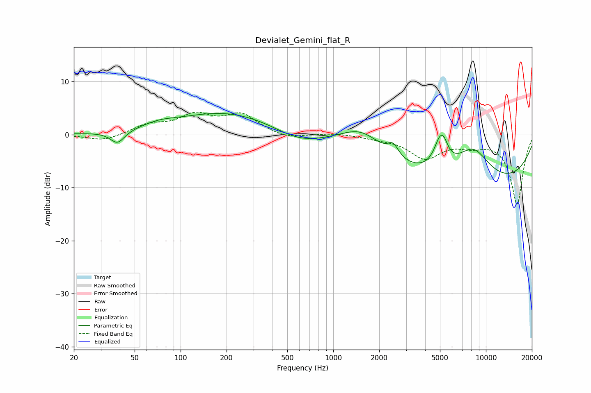

# Devialet_Gemini_flat_R
See [usage instructions](https://github.com/jaakkopasanen/AutoEq#usage) for more options and info.

### Parametric EQs
Apply preamp of -4.1 dB when using parametric equalizer.

|   # | Type    |   Fc (Hz) |    Q |   Gain (dB) |
|-----|---------|-----------|------|-------------|
|   1 | Peaking |        39 | 3.07 |        -2.4 |
|   2 | Peaking |        72 | 1.33 |         0.9 |
|   3 | Peaking |       200 | 0.42 |         4.3 |
|   4 | Peaking |       590 | 0.88 |        -2.1 |
|   5 | Peaking |      1534 | 0.98 |         4.5 |
|   6 | Peaking |      2467 | 4.1  |         2.2 |
|   7 | Peaking |      5040 | 3.27 |         5.8 |
|   8 | Peaking |      5347 | 5.86 |         1   |
|   9 | Peaking |      8087 | 0.2  |       -10.3 |
|  10 | Peaking |      8219 | 1.1  |         7   |

### Fixed Band EQs
When using fixed band (also called graphic) equalizer, apply preamp of **-4.3 dB** (if available) and set gains manually with these parameters.

|   # | Type    |   Fc (Hz) |    Q |   Gain (dB) |
|-----|---------|-----------|------|-------------|
|   1 | Peaking |        31 | 1.41 |        -1.3 |
|   2 | Peaking |        62 | 1.41 |         1.7 |
|   3 | Peaking |       125 | 1.41 |         3.3 |
|   4 | Peaking |       250 | 1.41 |         3.6 |
|   5 | Peaking |       500 | 1.41 |        -0.9 |
|   6 | Peaking |      1000 | 1.41 |         0.3 |
|   7 | Peaking |      2000 | 1.41 |        -0.5 |
|   8 | Peaking |      4000 | 1.41 |        -4.2 |
|   9 | Peaking |      8000 | 1.41 |        -1.5 |
|  10 | Peaking |     16000 | 1.41 |       -13.1 |

### Graphs

