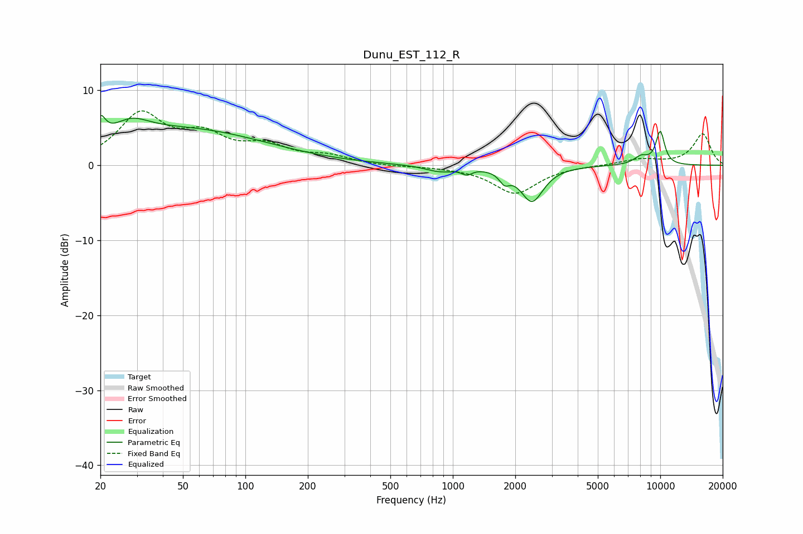

# Dunu_EST_112_R
See [usage instructions](https://github.com/jaakkopasanen/AutoEq#usage) for more options and info.

### Parametric EQs
Apply preamp of -6.7 dB when using parametric equalizer.

|   # | Type    |   Fc (Hz) |    Q |   Gain (dB) |
|-----|---------|-----------|------|-------------|
|   1 | Peaking |        20 | 5.99 |         2.7 |
|   2 | Peaking |        28 | 1.61 |         2.3 |
|   3 | Peaking |        52 | 0.36 |         4.7 |
|   4 | Peaking |       868 | 1.96 |        -0.8 |
|   5 | Peaking |      1170 | 5.93 |        -0.7 |
|   6 | Peaking |      1775 | 5.83 |        -1.4 |
|   7 | Peaking |      2409 | 2.61 |        -4.7 |
|   8 | Peaking |      8083 | 3.72 |         1.1 |
|   9 | Peaking |     10000 | 5.61 |         2.6 |
|  10 | Peaking |     10000 | 5.7  |         1.8 |

### Fixed Band EQs
When using fixed band (also called graphic) equalizer, apply preamp of **-7.3 dB** (if available) and set gains manually with these parameters.

|   # | Type    |   Fc (Hz) |    Q |   Gain (dB) |
|-----|---------|-----------|------|-------------|
|   1 | Peaking |        31 | 1.41 |         6.5 |
|   2 | Peaking |        62 | 1.41 |         3.4 |
|   3 | Peaking |       125 | 1.41 |         2.2 |
|   4 | Peaking |       250 | 1.41 |         1.1 |
|   5 | Peaking |       500 | 1.41 |        -0.2 |
|   6 | Peaking |      1000 | 1.41 |        -0.2 |
|   7 | Peaking |      2000 | 1.41 |        -3.7 |
|   8 | Peaking |      4000 | 1.41 |        -0   |
|   9 | Peaking |      8000 | 1.41 |         0.8 |
|  10 | Peaking |     16000 | 1.41 |         4.2 |

### Graphs

