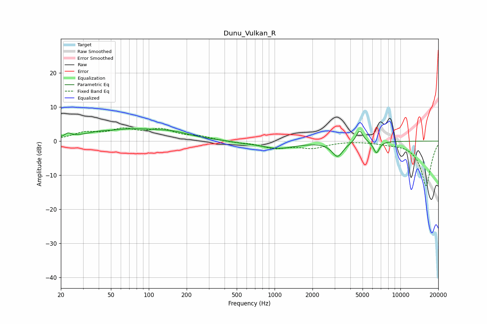

# Dunu_Vulkan_R
See [usage instructions](https://github.com/jaakkopasanen/AutoEq#usage) for more options and info.

### Parametric EQs
Apply preamp of -3.7 dB when using parametric equalizer.

|   # | Type    |   Fc (Hz) |    Q |   Gain (dB) |
|-----|---------|-----------|------|-------------|
|   1 | Peaking |        23 | 5.99 |         1.1 |
|   2 | Peaking |        43 | 1.54 |         0.6 |
|   3 | Peaking |        48 | 1.9  |        -0.4 |
|   4 | Peaking |        74 | 0.45 |         3.4 |
|   5 | Peaking |       158 | 1.29 |         0.8 |
|   6 | Peaking |       538 | 2    |        -0.3 |
|   7 | Peaking |      1059 | 1.01 |        -2.1 |
|   8 | Peaking |      3163 | 3.2  |        -4.3 |
|   9 | Peaking |      4738 | 5.27 |         3.7 |
|  10 | Peaking |      6448 | 5.88 |        -3.5 |

### Fixed Band EQs
When using fixed band (also called graphic) equalizer, apply preamp of **-4.0 dB** (if available) and set gains manually with these parameters.

|   # | Type    |   Fc (Hz) |    Q |   Gain (dB) |
|-----|---------|-----------|------|-------------|
|   1 | Peaking |        31 | 1.41 |         2.2 |
|   2 | Peaking |        62 | 1.41 |         2.9 |
|   3 | Peaking |       125 | 1.41 |         3   |
|   4 | Peaking |       250 | 1.41 |         1.1 |
|   5 | Peaking |       500 | 1.41 |        -0.3 |
|   6 | Peaking |      1000 | 1.41 |        -1.9 |
|   7 | Peaking |      2000 | 1.41 |        -1.8 |
|   8 | Peaking |      4000 | 1.41 |         0.1 |
|   9 | Peaking |      8000 | 1.41 |        -0.5 |
|  10 | Peaking |     16000 | 1.41 |       -13.1 |

### Graphs

