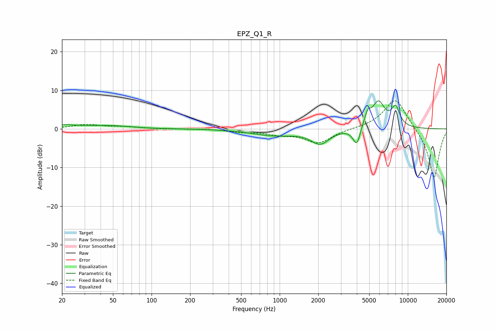

# EPZ_Q1_R
See [usage instructions](https://github.com/jaakkopasanen/AutoEq#usage) for more options and info.

### Parametric EQs
Apply preamp of -7.4 dB when using parametric equalizer.

|   # | Type    |   Fc (Hz) |    Q |   Gain (dB) |
|-----|---------|-----------|------|-------------|
|   1 | Peaking |        20 | 1.15 |         0.9 |
|   2 | Peaking |        47 | 0.92 |         0.8 |
|   3 | Peaking |       902 | 0.83 |        -1.6 |
|   4 | Peaking |      2071 | 1.95 |        -3.6 |
|   5 | Peaking |      4034 | 4.24 |        -6.3 |
|   6 | Peaking |      4232 | 1.79 |         0.6 |
|   7 | Peaking |      4270 | 4.27 |         1.5 |
|   8 | Peaking |      4861 | 5.83 |         2.8 |
|   9 | Peaking |      5896 | 2.68 |         6.7 |
|  10 | Peaking |      8033 | 4.03 |         4.8 |

### Fixed Band EQs
When using fixed band (also called graphic) equalizer, apply preamp of **-7.4 dB** (if available) and set gains manually with these parameters.

|   # | Type    |   Fc (Hz) |    Q |   Gain (dB) |
|-----|---------|-----------|------|-------------|
|   1 | Peaking |        31 | 1.41 |         1.1 |
|   2 | Peaking |        62 | 1.41 |         0.5 |
|   3 | Peaking |       125 | 1.41 |        -0.1 |
|   4 | Peaking |       250 | 1.41 |         0.1 |
|   5 | Peaking |       500 | 1.41 |        -0.7 |
|   6 | Peaking |      1000 | 1.41 |        -1.1 |
|   7 | Peaking |      2000 | 1.41 |        -3.6 |
|   8 | Peaking |      4000 | 1.41 |         0   |
|   9 | Peaking |      8000 | 1.41 |         8.2 |
|  10 | Peaking |     16000 | 1.41 |       -13.1 |

### Graphs

