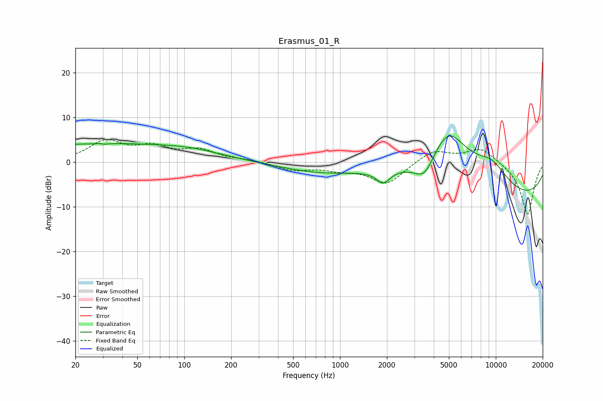

# Erasmus_01_R
See [usage instructions](https://github.com/jaakkopasanen/AutoEq#usage) for more options and info.

### Parametric EQs
Apply preamp of -6.0 dB when using parametric equalizer.

|   # | Type    |   Fc (Hz) |    Q |   Gain (dB) |
|-----|---------|-----------|------|-------------|
|   1 | Peaking |        25 | 0.31 |         3.9 |
|   2 | Peaking |        29 | 5.49 |         3.5 |
|   3 | Peaking |        29 | 5.12 |        -3.5 |
|   4 | Peaking |       109 | 0.61 |         1.9 |
|   5 | Peaking |       711 | 0.58 |        -1.9 |
|   6 | Peaking |      1894 | 3.42 |        -2.7 |
|   7 | Peaking |      3484 | 2.2  |        -4.7 |
|   8 | Peaking |      4943 | 0.93 |        13.8 |
|   9 | Peaking |      9423 | 1.12 |         5.2 |
|  10 | Peaking |     10000 | 0.19 |        -9   |

### Fixed Band EQs
When using fixed band (also called graphic) equalizer, apply preamp of **-5.2 dB** (if available) and set gains manually with these parameters.

|   # | Type    |   Fc (Hz) |    Q |   Gain (dB) |
|-----|---------|-----------|------|-------------|
|   1 | Peaking |        31 | 1.41 |         4.4 |
|   2 | Peaking |        62 | 1.41 |         2.9 |
|   3 | Peaking |       125 | 1.41 |         2.4 |
|   4 | Peaking |       250 | 1.41 |         0.4 |
|   5 | Peaking |       500 | 1.41 |        -1.7 |
|   6 | Peaking |      1000 | 1.41 |        -1.3 |
|   7 | Peaking |      2000 | 1.41 |        -4.8 |
|   8 | Peaking |      4000 | 1.41 |         2.8 |
|   9 | Peaking |      8000 | 1.41 |         3.3 |
|  10 | Peaking |     16000 | 1.41 |       -11.8 |

### Graphs

