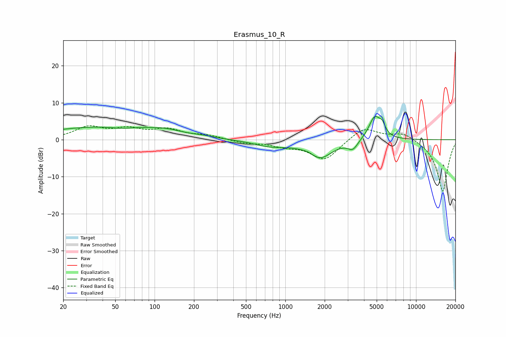

# Erasmus_10_R
See [usage instructions](https://github.com/jaakkopasanen/AutoEq#usage) for more options and info.

### Parametric EQs
Apply preamp of -6.4 dB when using parametric equalizer.

|   # | Type    |   Fc (Hz) |    Q |   Gain (dB) |
|-----|---------|-----------|------|-------------|
|   1 | Peaking |        37 | 0.33 |         3.3 |
|   2 | Peaking |        55 | 2.23 |        -0.4 |
|   3 | Peaking |       119 | 0.95 |         1.4 |
|   4 | Peaking |       239 | 1.89 |         0.3 |
|   5 | Peaking |       778 | 1.09 |        -1.6 |
|   6 | Peaking |      1527 | 2.96 |         0.7 |
|   7 | Peaking |      1819 | 1.48 |        -5   |
|   8 | Peaking |      3287 | 3.74 |        -2.4 |
|   9 | Peaking |      4832 | 3.03 |         6.3 |
|  10 | Peaking |      5521 | 6    |         2.2 |

### Fixed Band EQs
When using fixed band (also called graphic) equalizer, apply preamp of **-3.9 dB** (if available) and set gains manually with these parameters.

|   # | Type    |   Fc (Hz) |    Q |   Gain (dB) |
|-----|---------|-----------|------|-------------|
|   1 | Peaking |        31 | 1.41 |         3.2 |
|   2 | Peaking |        62 | 1.41 |         2.5 |
|   3 | Peaking |       125 | 1.41 |         2.5 |
|   4 | Peaking |       250 | 1.41 |         1.1 |
|   5 | Peaking |       500 | 1.41 |        -0.9 |
|   6 | Peaking |      1000 | 1.41 |        -1.4 |
|   7 | Peaking |      2000 | 1.41 |        -5.5 |
|   8 | Peaking |      4000 | 1.41 |         3.6 |
|   9 | Peaking |      8000 | 1.41 |         2   |
|  10 | Peaking |     16000 | 1.41 |       -14.1 |

### Graphs

