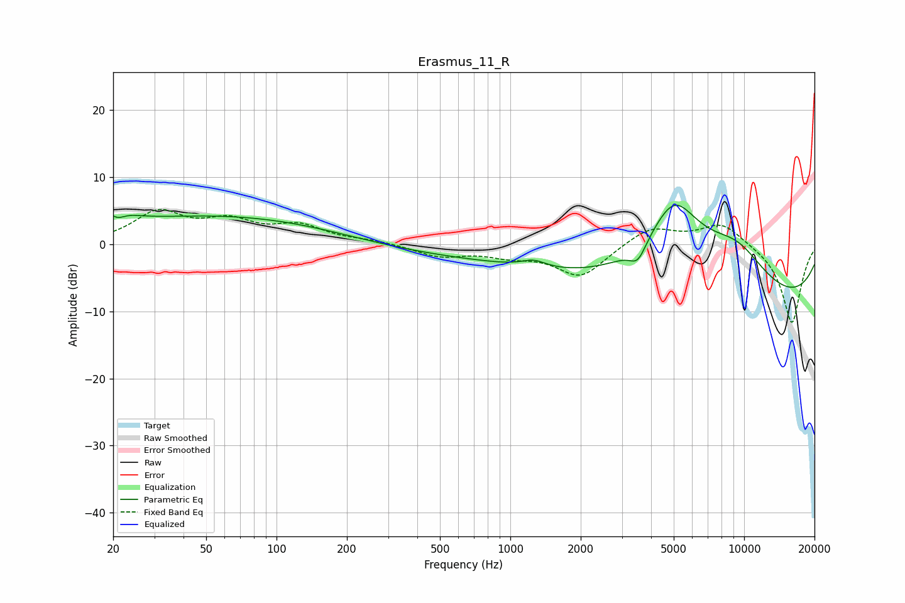

# Erasmus_11_R
See [usage instructions](https://github.com/jaakkopasanen/AutoEq#usage) for more options and info.

### Parametric EQs
Apply preamp of -5.9 dB when using parametric equalizer.

|   # | Type    |   Fc (Hz) |    Q |   Gain (dB) |
|-----|---------|-----------|------|-------------|
|   1 | Peaking |        20 | 2.27 |         3.6 |
|   2 | Peaking |        21 | 3.89 |        -2.4 |
|   3 | Peaking |        59 | 0.27 |         4.3 |
|   4 | Peaking |       708 | 0.26 |        -1.9 |
|   5 | Peaking |      1260 | 2.73 |         1.3 |
|   6 | Peaking |      1262 | 2.69 |        -0.2 |
|   7 | Peaking |      3514 | 4    |        -2.6 |
|   8 | Peaking |      5012 | 1.04 |        13   |
|   9 | Peaking |      9259 | 0.86 |         6.7 |
|  10 | Peaking |      9416 | 0.18 |       -10   |

### Fixed Band EQs
When using fixed band (also called graphic) equalizer, apply preamp of **-5.3 dB** (if available) and set gains manually with these parameters.

|   # | Type    |   Fc (Hz) |    Q |   Gain (dB) |
|-----|---------|-----------|------|-------------|
|   1 | Peaking |        31 | 1.41 |         4.5 |
|   2 | Peaking |        62 | 1.41 |         3   |
|   3 | Peaking |       125 | 1.41 |         2.5 |
|   4 | Peaking |       250 | 1.41 |         0.5 |
|   5 | Peaking |       500 | 1.41 |        -1.7 |
|   6 | Peaking |      1000 | 1.41 |        -1.4 |
|   7 | Peaking |      2000 | 1.41 |        -4.8 |
|   8 | Peaking |      4000 | 1.41 |         2.7 |
|   9 | Peaking |      8000 | 1.41 |         3.3 |
|  10 | Peaking |     16000 | 1.41 |       -11.9 |

### Graphs

