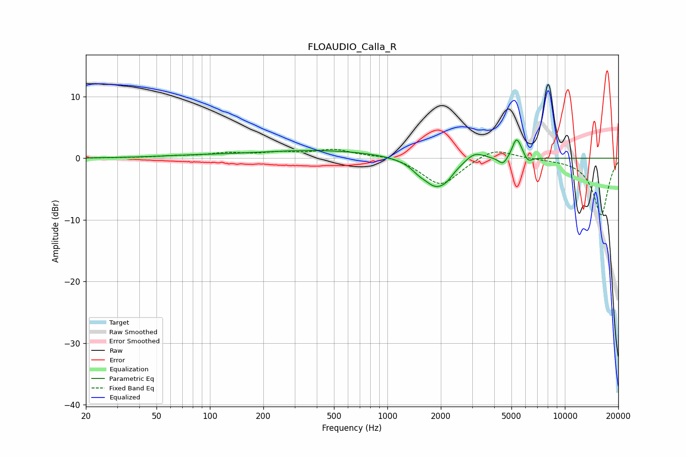

# FLOAUDIO_Calla_R
See [usage instructions](https://github.com/jaakkopasanen/AutoEq#usage) for more options and info.

### Parametric EQs
Apply preamp of -3.1 dB when using parametric equalizer.

|   # | Type    |   Fc (Hz) |    Q |   Gain (dB) |
|-----|---------|-----------|------|-------------|
|   1 | Peaking |        80 | 0.65 |         0.3 |
|   2 | Peaking |       423 | 0.38 |         1.3 |
|   3 | Peaking |      1497 | 3.78 |        -0.6 |
|   4 | Peaking |      1899 | 1.77 |        -4.9 |
|   5 | Peaking |      2173 | 5.33 |        -0.4 |
|   6 | Peaking |      3102 | 2.54 |         1.6 |
|   7 | Peaking |      4474 | 5.83 |        -1.2 |
|   8 | Peaking |      5320 | 6    |         2.9 |
|   9 | Peaking |      5630 | 6    |         0.7 |
|  10 | Peaking |      6201 | 6    |        -1   |

### Fixed Band EQs
When using fixed band (also called graphic) equalizer, apply preamp of **-1.6 dB** (if available) and set gains manually with these parameters.

|   # | Type    |   Fc (Hz) |    Q |   Gain (dB) |
|-----|---------|-----------|------|-------------|
|   1 | Peaking |        31 | 1.41 |         0.1 |
|   2 | Peaking |        62 | 1.41 |         0.3 |
|   3 | Peaking |       125 | 1.41 |         0.7 |
|   4 | Peaking |       250 | 1.41 |         0.8 |
|   5 | Peaking |       500 | 1.41 |         1.3 |
|   6 | Peaking |      1000 | 1.41 |         0.6 |
|   7 | Peaking |      2000 | 1.41 |        -4.5 |
|   8 | Peaking |      4000 | 1.41 |         1.9 |
|   9 | Peaking |      8000 | 1.41 |        -0.1 |
|  10 | Peaking |     16000 | 1.41 |        -9.2 |

### Graphs

