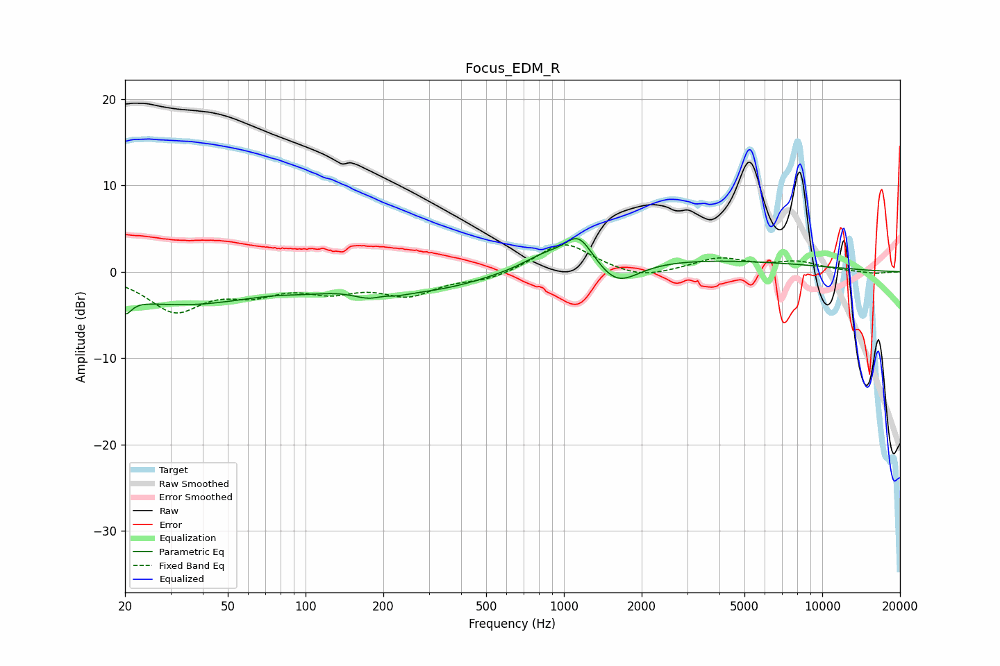

# Focus_EDM_R
See [usage instructions](https://github.com/jaakkopasanen/AutoEq#usage) for more options and info.

### Parametric EQs
Apply preamp of -3.9 dB when using parametric equalizer.

|   # | Type    |   Fc (Hz) |    Q |   Gain (dB) |
|-----|---------|-----------|------|-------------|
|   1 | Peaking |        20 | 5.76 |        -1.8 |
|   2 | Peaking |        33 | 0.45 |        -3.7 |
|   3 | Peaking |       103 | 1.41 |        -0.6 |
|   4 | Peaking |       193 | 1.79 |        -2.8 |
|   5 | Peaking |       198 | 2.82 |         1.4 |
|   6 | Peaking |       334 | 0.75 |        -1.7 |
|   7 | Peaking |       832 | 1.75 |         1.3 |
|   8 | Peaking |      1142 | 2.48 |         3.6 |
|   9 | Peaking |      1603 | 1.7  |        -2.9 |
|  10 | Peaking |      2720 | 0.27 |         1.5 |

### Fixed Band EQs
When using fixed band (also called graphic) equalizer, apply preamp of **-3.2 dB** (if available) and set gains manually with these parameters.

|   # | Type    |   Fc (Hz) |    Q |   Gain (dB) |
|-----|---------|-----------|------|-------------|
|   1 | Peaking |        31 | 1.41 |        -4.3 |
|   2 | Peaking |        62 | 1.41 |        -2   |
|   3 | Peaking |       125 | 1.41 |        -1.8 |
|   4 | Peaking |       250 | 1.41 |        -2.4 |
|   5 | Peaking |       500 | 1.41 |        -0.9 |
|   6 | Peaking |      1000 | 1.41 |         3.5 |
|   7 | Peaking |      2000 | 1.41 |        -1   |
|   8 | Peaking |      4000 | 1.41 |         1.5 |
|   9 | Peaking |      8000 | 1.41 |         1   |
|  10 | Peaking |     16000 | 1.41 |        -0.2 |

### Graphs

