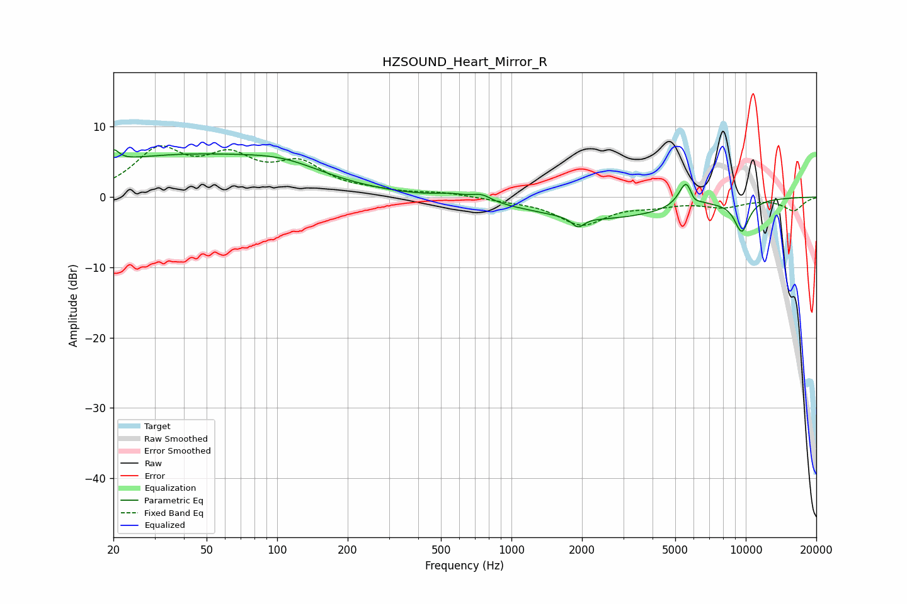

# HZSOUND_Heart_Mirror_R
See [usage instructions](https://github.com/jaakkopasanen/AutoEq#usage) for more options and info.

### Parametric EQs
Apply preamp of -6.8 dB when using parametric equalizer.

|   # | Type    |   Fc (Hz) |    Q |   Gain (dB) |
|-----|---------|-----------|------|-------------|
|   1 | Peaking |        20 | 5.99 |         1.8 |
|   2 | Peaking |        37 | 0.3  |         5.7 |
|   3 | Peaking |       108 | 0.83 |         1.9 |
|   4 | Peaking |       554 | 2.11 |         0.6 |
|   5 | Peaking |       746 | 3.39 |         0.9 |
|   6 | Peaking |      1923 | 5.51 |        -1.4 |
|   7 | Peaking |      2371 | 0.48 |        -3   |
|   8 | Peaking |      5620 | 4.27 |         4.5 |
|   9 | Peaking |      5950 | 6    |        -1.7 |
|  10 | Peaking |      9613 | 3.9  |        -4.4 |

### Fixed Band EQs
When using fixed band (also called graphic) equalizer, apply preamp of **-7.4 dB** (if available) and set gains manually with these parameters.

|   # | Type    |   Fc (Hz) |    Q |   Gain (dB) |
|-----|---------|-----------|------|-------------|
|   1 | Peaking |        31 | 1.41 |         6.2 |
|   2 | Peaking |        62 | 1.41 |         4.8 |
|   3 | Peaking |       125 | 1.41 |         4.2 |
|   4 | Peaking |       250 | 1.41 |         0.6 |
|   5 | Peaking |       500 | 1.41 |         0.5 |
|   6 | Peaking |      1000 | 1.41 |        -0.3 |
|   7 | Peaking |      2000 | 1.41 |        -3.8 |
|   8 | Peaking |      4000 | 1.41 |        -0.9 |
|   9 | Peaking |      8000 | 1.41 |        -1.2 |
|  10 | Peaking |     16000 | 1.41 |        -1.9 |

### Graphs

