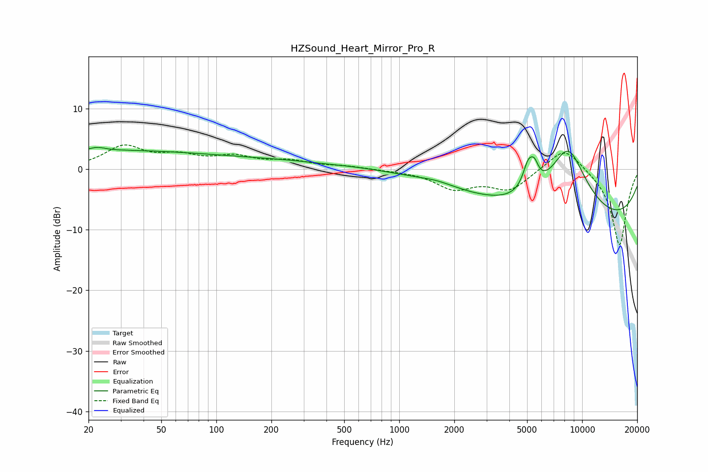

# HZSound_Heart_Mirror_Pro_R
See [usage instructions](https://github.com/jaakkopasanen/AutoEq#usage) for more options and info.

### Parametric EQs
Apply preamp of -3.7 dB when using parametric equalizer.

|   # | Type    |   Fc (Hz) |    Q |   Gain (dB) |
|-----|---------|-----------|------|-------------|
|   1 | Peaking |        20 | 0.22 |         3   |
|   2 | Peaking |        23 | 5.51 |         2.9 |
|   3 | Peaking |        23 | 5.96 |        -2.4 |
|   4 | Peaking |       216 | 0.34 |         1.3 |
|   5 | Peaking |       371 | 1.41 |        -0.1 |
|   6 | Peaking |      1604 | 1.57 |         0.5 |
|   7 | Peaking |      5076 | 4.57 |         4.2 |
|   8 | Peaking |      5491 | 6    |         2.4 |
|   9 | Peaking |      8372 | 1.1  |        12.6 |
|  10 | Peaking |     10000 | 0.21 |        -9.9 |

### Fixed Band EQs
When using fixed band (also called graphic) equalizer, apply preamp of **-4.1 dB** (if available) and set gains manually with these parameters.

|   # | Type    |   Fc (Hz) |    Q |   Gain (dB) |
|-----|---------|-----------|------|-------------|
|   1 | Peaking |        31 | 1.41 |         3.6 |
|   2 | Peaking |        62 | 1.41 |         1.8 |
|   3 | Peaking |       125 | 1.41 |         1.8 |
|   4 | Peaking |       250 | 1.41 |         1.2 |
|   5 | Peaking |       500 | 1.41 |         0.4 |
|   6 | Peaking |      1000 | 1.41 |        -0.2 |
|   7 | Peaking |      2000 | 1.41 |        -3   |
|   8 | Peaking |      4000 | 1.41 |        -3.3 |
|   9 | Peaking |      8000 | 1.41 |         4   |
|  10 | Peaking |     16000 | 1.41 |       -12.7 |

### Graphs

