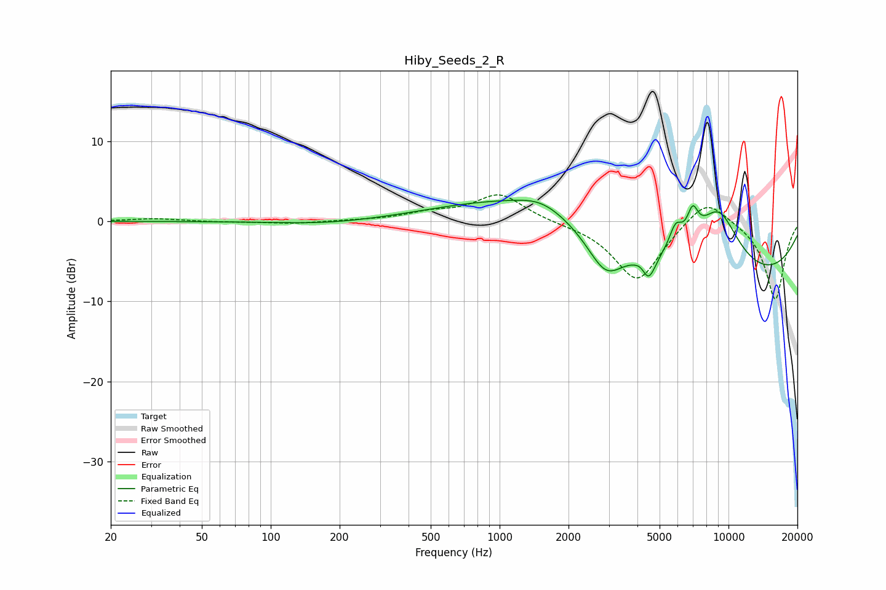

# Hiby_Seeds_2_R
See [usage instructions](https://github.com/jaakkopasanen/AutoEq#usage) for more options and info.

### Parametric EQs
Apply preamp of -2.7 dB when using parametric equalizer.

|   # | Type    |   Fc (Hz) |    Q |   Gain (dB) |
|-----|---------|-----------|------|-------------|
|   1 | Peaking |       176 | 0.67 |        -0.4 |
|   2 | Peaking |      1523 | 1.35 |         1.4 |
|   3 | Peaking |      1734 | 0.33 |         4.4 |
|   4 | Peaking |      2907 | 1.74 |        -4.9 |
|   5 | Peaking |      4211 | 5.43 |         0.9 |
|   6 | Peaking |      4453 | 4.37 |        -3.5 |
|   7 | Peaking |      5879 | 4.75 |         2.9 |
|   8 | Peaking |      6974 | 5.46 |         3.5 |
|   9 | Peaking |      8789 | 0.21 |        -8.3 |
|  10 | Peaking |      9015 | 1.27 |         8.4 |

### Fixed Band EQs
When using fixed band (also called graphic) equalizer, apply preamp of **-3.4 dB** (if available) and set gains manually with these parameters.

|   # | Type    |   Fc (Hz) |    Q |   Gain (dB) |
|-----|---------|-----------|------|-------------|
|   1 | Peaking |        31 | 1.41 |         0.3 |
|   2 | Peaking |        62 | 1.41 |        -0.1 |
|   3 | Peaking |       125 | 1.41 |        -0.3 |
|   4 | Peaking |       250 | 1.41 |         0.1 |
|   5 | Peaking |       500 | 1.41 |         0.9 |
|   6 | Peaking |      1000 | 1.41 |         3.4 |
|   7 | Peaking |      2000 | 1.41 |        -0.2 |
|   8 | Peaking |      4000 | 1.41 |        -7.5 |
|   9 | Peaking |      8000 | 1.41 |         3.4 |
|  10 | Peaking |     16000 | 1.41 |        -9.9 |

### Graphs

