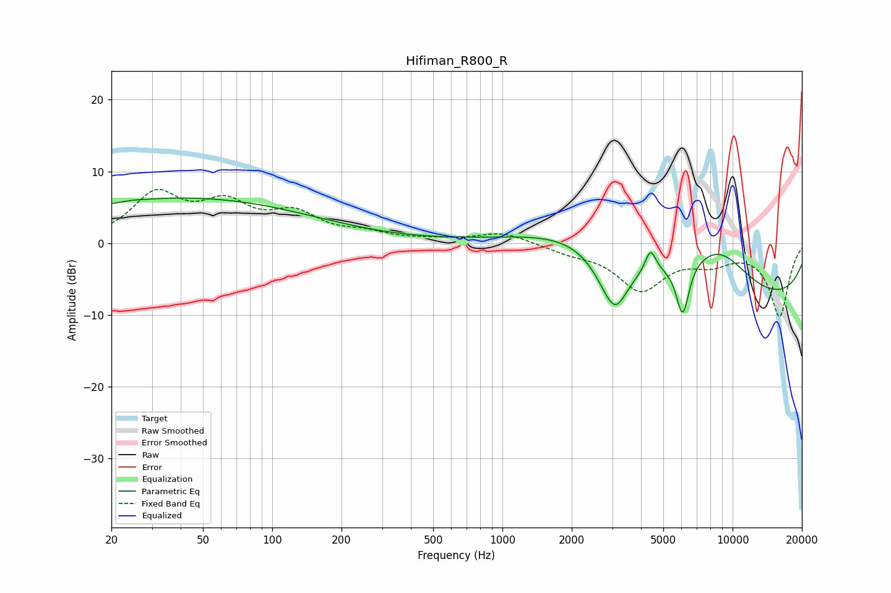

# Hifiman_R800_R
See [usage instructions](https://github.com/jaakkopasanen/AutoEq#usage) for more options and info.

### Parametric EQs
Apply preamp of -6.4 dB when using parametric equalizer.

|   # | Type    |   Fc (Hz) |    Q |   Gain (dB) |
|-----|---------|-----------|------|-------------|
|   1 | Peaking |        25 | 5.28 |         0.1 |
|   2 | Peaking |        41 | 0.24 |         6.3 |
|   3 | Peaking |      2507 | 0.5  |         5.5 |
|   4 | Peaking |      3028 | 1.89 |        -7.9 |
|   5 | Peaking |      3141 | 4.3  |        -0.9 |
|   6 | Peaking |      4400 | 5.89 |         3.2 |
|   7 | Peaking |      6028 | 5.09 |        -6.2 |
|   8 | Peaking |      6252 | 5.99 |        -1.3 |
|   9 | Peaking |      8643 | 0.89 |         6.5 |
|  10 | Peaking |      9929 | 0.18 |        -8.8 |

### Fixed Band EQs
When using fixed band (also called graphic) equalizer, apply preamp of **-7.6 dB** (if available) and set gains manually with these parameters.

|   # | Type    |   Fc (Hz) |    Q |   Gain (dB) |
|-----|---------|-----------|------|-------------|
|   1 | Peaking |        31 | 1.41 |         6.5 |
|   2 | Peaking |        62 | 1.41 |         4.7 |
|   3 | Peaking |       125 | 1.41 |         3.6 |
|   4 | Peaking |       250 | 1.41 |         1.1 |
|   5 | Peaking |       500 | 1.41 |         0.3 |
|   6 | Peaking |      1000 | 1.41 |         1.5 |
|   7 | Peaking |      2000 | 1.41 |        -1   |
|   8 | Peaking |      4000 | 1.41 |        -6.2 |
|   9 | Peaking |      8000 | 1.41 |        -2.1 |
|  10 | Peaking |     16000 | 1.41 |       -10.1 |

### Graphs

