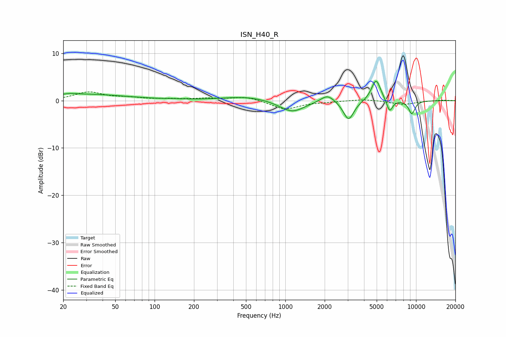

# ISN_H40_R
See [usage instructions](https://github.com/jaakkopasanen/AutoEq#usage) for more options and info.

### Parametric EQs
Apply preamp of -4.2 dB when using parametric equalizer.

|   # | Type    |   Fc (Hz) |    Q |   Gain (dB) |
|-----|---------|-----------|------|-------------|
|   1 | Peaking |        23 | 3.99 |         0.2 |
|   2 | Peaking |        27 | 0.4  |         1.4 |
|   3 | Peaking |       144 | 1.87 |         0.1 |
|   4 | Peaking |       504 | 0.83 |         0.9 |
|   5 | Peaking |      1126 | 1.48 |        -2.5 |
|   6 | Peaking |      2103 | 2.67 |         1.7 |
|   7 | Peaking |      3048 | 3.45 |        -4.2 |
|   8 | Peaking |      4945 | 3.92 |         4.7 |
|   9 | Peaking |      6283 | 6    |        -2.6 |
|  10 | Peaking |      9285 | 5.15 |        -2.8 |

### Fixed Band EQs
When using fixed band (also called graphic) equalizer, apply preamp of **-1.9 dB** (if available) and set gains manually with these parameters.

|   # | Type    |   Fc (Hz) |    Q |   Gain (dB) |
|-----|---------|-----------|------|-------------|
|   1 | Peaking |        31 | 1.41 |         1.7 |
|   2 | Peaking |        62 | 1.41 |         0.5 |
|   3 | Peaking |       125 | 1.41 |         0.3 |
|   4 | Peaking |       250 | 1.41 |         0.4 |
|   5 | Peaking |       500 | 1.41 |         0.9 |
|   6 | Peaking |      1000 | 1.41 |        -1.9 |
|   7 | Peaking |      2000 | 1.41 |        -0.2 |
|   8 | Peaking |      4000 | 1.41 |         0.3 |
|   9 | Peaking |      8000 | 1.41 |        -0.8 |
|  10 | Peaking |     16000 | 1.41 |         0.1 |

### Graphs

