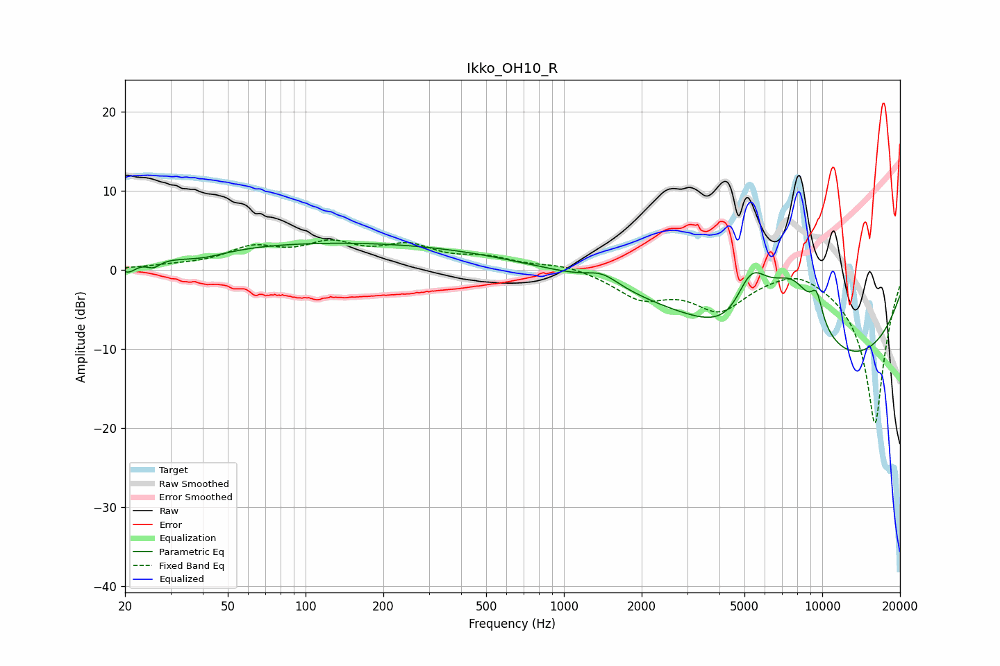

# Ikko_OH10_R
See [usage instructions](https://github.com/jaakkopasanen/AutoEq#usage) for more options and info.

### Parametric EQs
Apply preamp of -3.5 dB when using parametric equalizer.

|   # | Type    |   Fc (Hz) |    Q |   Gain (dB) |
|-----|---------|-----------|------|-------------|
|   1 | Peaking |        21 | 4.8  |        -1.2 |
|   2 | Peaking |        26 | 5.73 |        -0.8 |
|   3 | Peaking |        40 | 1.5  |        -0.8 |
|   4 | Peaking |       133 | 0.21 |         3.5 |
|   5 | Peaking |      1411 | 2.24 |         1.4 |
|   6 | Peaking |      4814 | 1.07 |        -8.7 |
|   7 | Peaking |      5264 | 1.35 |        14.4 |
|   8 | Peaking |      7747 | 1.22 |         8.8 |
|   9 | Peaking |      9515 | 5.48 |         3.4 |
|  10 | Peaking |     10000 | 0.26 |       -13.4 |

### Fixed Band EQs
When using fixed band (also called graphic) equalizer, apply preamp of **-3.9 dB** (if available) and set gains manually with these parameters.

|   # | Type    |   Fc (Hz) |    Q |   Gain (dB) |
|-----|---------|-----------|------|-------------|
|   1 | Peaking |        31 | 1.41 |         0.4 |
|   2 | Peaking |        62 | 1.41 |         2.5 |
|   3 | Peaking |       125 | 1.41 |         2.8 |
|   4 | Peaking |       250 | 1.41 |         2.6 |
|   5 | Peaking |       500 | 1.41 |         1.3 |
|   6 | Peaking |      1000 | 1.41 |         0.8 |
|   7 | Peaking |      2000 | 1.41 |        -3.2 |
|   8 | Peaking |      4000 | 1.41 |        -4.6 |
|   9 | Peaking |      8000 | 1.41 |         1.4 |
|  10 | Peaking |     16000 | 1.41 |       -19.5 |

### Graphs

