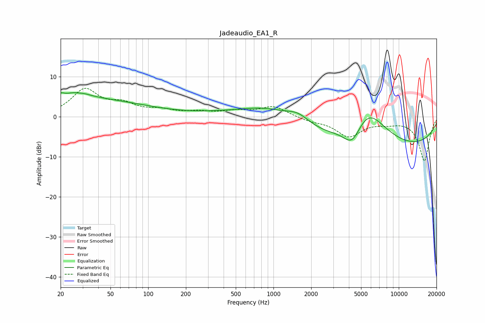

# Jadeaudio_EA1_R
See [usage instructions](https://github.com/jaakkopasanen/AutoEq#usage) for more options and info.

### Parametric EQs
Apply preamp of -6.2 dB when using parametric equalizer.

|   # | Type    |   Fc (Hz) |    Q |   Gain (dB) |
|-----|---------|-----------|------|-------------|
|   1 | Peaking |        20 | 5.31 |         0.9 |
|   2 | Peaking |        27 | 1.68 |         1.6 |
|   3 | Peaking |        28 | 0.26 |         4.5 |
|   4 | Peaking |        28 | 5.93 |        -0.2 |
|   5 | Peaking |       408 | 0.55 |         0.6 |
|   6 | Peaking |       900 | 0.69 |         3.1 |
|   7 | Peaking |      1569 | 1.45 |         2.7 |
|   8 | Peaking |      4250 | 1.99 |        -5.2 |
|   9 | Peaking |      5661 | 0.92 |         9.6 |
|  10 | Peaking |      7413 | 0.18 |        -8.5 |

### Fixed Band EQs
When using fixed band (also called graphic) equalizer, apply preamp of **-7.2 dB** (if available) and set gains manually with these parameters.

|   # | Type    |   Fc (Hz) |    Q |   Gain (dB) |
|-----|---------|-----------|------|-------------|
|   1 | Peaking |        31 | 1.41 |         6.6 |
|   2 | Peaking |        62 | 1.41 |         2.6 |
|   3 | Peaking |       125 | 1.41 |         1.4 |
|   4 | Peaking |       250 | 1.41 |         1   |
|   5 | Peaking |       500 | 1.41 |         1.2 |
|   6 | Peaking |      1000 | 1.41 |         2.6 |
|   7 | Peaking |      2000 | 1.41 |        -0.9 |
|   8 | Peaking |      4000 | 1.41 |        -4.7 |
|   9 | Peaking |      8000 | 1.41 |        -1   |
|  10 | Peaking |     16000 | 1.41 |       -10.9 |

### Graphs

