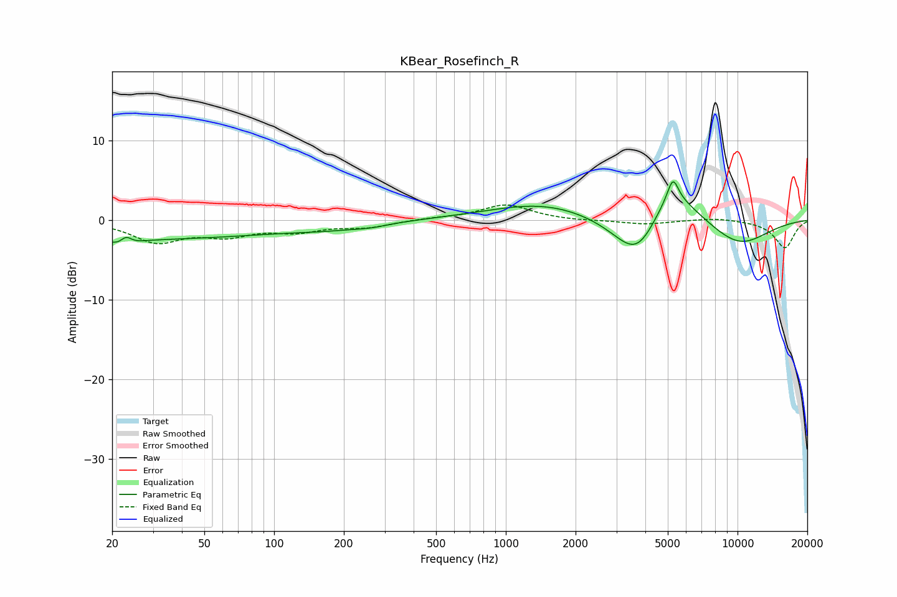

# KBear_Rosefinch_R
See [usage instructions](https://github.com/jaakkopasanen/AutoEq#usage) for more options and info.

### Parametric EQs
Apply preamp of -4.9 dB when using parametric equalizer.

|   # | Type    |   Fc (Hz) |    Q |   Gain (dB) |
|-----|---------|-----------|------|-------------|
|   1 | Peaking |        23 | 3.53 |        -2.2 |
|   2 | Peaking |        23 | 5.02 |         2.3 |
|   3 | Peaking |        24 | 0.21 |        -2.4 |
|   4 | Peaking |       175 | 0.84 |        -0.6 |
|   5 | Peaking |       263 | 1.97 |        -0.3 |
|   6 | Peaking |      1454 | 0.61 |         2.2 |
|   7 | Peaking |      3734 | 1.29 |        -7.5 |
|   8 | Peaking |      5037 | 1.11 |         6.6 |
|   9 | Peaking |      5263 | 5.98 |         2.8 |
|  10 | Peaking |     10000 | 0.87 |        -3.4 |

### Fixed Band EQs
When using fixed band (also called graphic) equalizer, apply preamp of **-2.0 dB** (if available) and set gains manually with these parameters.

|   # | Type    |   Fc (Hz) |    Q |   Gain (dB) |
|-----|---------|-----------|------|-------------|
|   1 | Peaking |        31 | 1.41 |        -2.6 |
|   2 | Peaking |        62 | 1.41 |        -1.7 |
|   3 | Peaking |       125 | 1.41 |        -1.2 |
|   4 | Peaking |       250 | 1.41 |        -0.8 |
|   5 | Peaking |       500 | 1.41 |         0.2 |
|   6 | Peaking |      1000 | 1.41 |         1.9 |
|   7 | Peaking |      2000 | 1.41 |        -0.1 |
|   8 | Peaking |      4000 | 1.41 |        -0.5 |
|   9 | Peaking |      8000 | 1.41 |         0.3 |
|  10 | Peaking |     16000 | 1.41 |        -3.5 |

### Graphs

