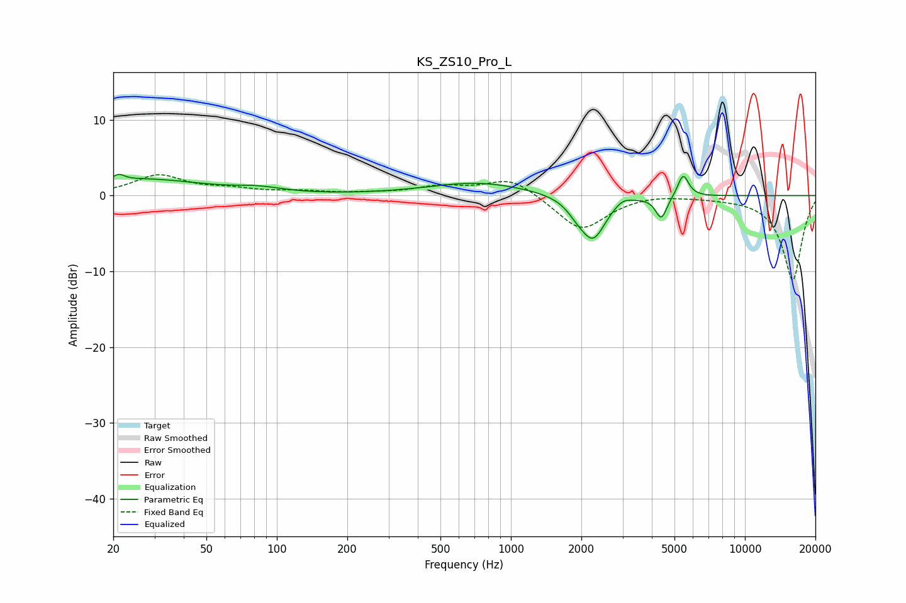

# KS_ZS10_Pro_L
See [usage instructions](https://github.com/jaakkopasanen/AutoEq#usage) for more options and info.

### Parametric EQs
Apply preamp of -2.9 dB when using parametric equalizer.

|   # | Type    |   Fc (Hz) |    Q |   Gain (dB) |
|-----|---------|-----------|------|-------------|
|   1 | Peaking |        21 | 6    |        -1.7 |
|   2 | Peaking |        21 | 5.98 |         2.5 |
|   3 | Peaking |        27 | 0.54 |         2.1 |
|   4 | Peaking |        84 | 1.43 |         0.6 |
|   5 | Peaking |       726 | 0.66 |         1.7 |
|   6 | Peaking |      1904 | 3.66 |        -0.9 |
|   7 | Peaking |      2241 | 2.54 |        -5.8 |
|   8 | Peaking |      3000 | 3.64 |         0.8 |
|   9 | Peaking |      4393 | 5.87 |        -3   |
|  10 | Peaking |      5444 | 6    |         3   |

### Fixed Band EQs
When using fixed band (also called graphic) equalizer, apply preamp of **-2.9 dB** (if available) and set gains manually with these parameters.

|   # | Type    |   Fc (Hz) |    Q |   Gain (dB) |
|-----|---------|-----------|------|-------------|
|   1 | Peaking |        31 | 1.41 |         2.6 |
|   2 | Peaking |        62 | 1.41 |         0.7 |
|   3 | Peaking |       125 | 1.41 |         0.5 |
|   4 | Peaking |       250 | 1.41 |         0.2 |
|   5 | Peaking |       500 | 1.41 |         1.1 |
|   6 | Peaking |      1000 | 1.41 |         2.4 |
|   7 | Peaking |      2000 | 1.41 |        -4.7 |
|   8 | Peaking |      4000 | 1.41 |         0.4 |
|   9 | Peaking |      8000 | 1.41 |        -0.1 |
|  10 | Peaking |     16000 | 1.41 |       -11.2 |

### Graphs

