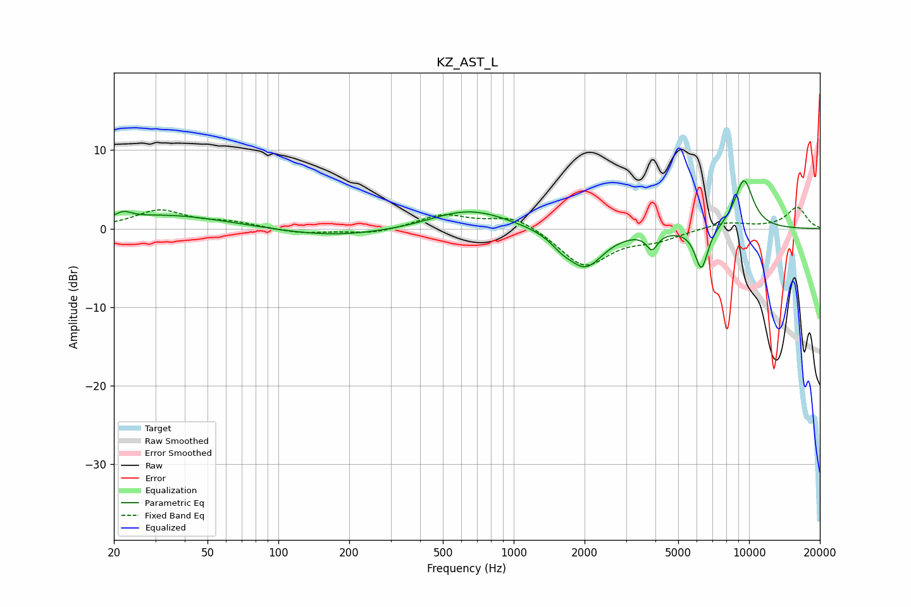

# KZ_AST_L
See [usage instructions](https://github.com/jaakkopasanen/AutoEq#usage) for more options and info.

### Parametric EQs
Apply preamp of -6.2 dB when using parametric equalizer.

|   # | Type    |   Fc (Hz) |    Q |   Gain (dB) |
|-----|---------|-----------|------|-------------|
|   1 | Peaking |        22 | 4.34 |         0.8 |
|   2 | Peaking |        34 | 0.54 |         1.8 |
|   3 | Peaking |       173 | 0.58 |        -1.1 |
|   4 | Peaking |       523 | 1.25 |         0.3 |
|   5 | Peaking |       676 | 0.89 |         2.3 |
|   6 | Peaking |      1595 | 3.02 |        -1   |
|   7 | Peaking |      2014 | 1.81 |        -4.8 |
|   8 | Peaking |      3873 | 6    |        -2.1 |
|   9 | Peaking |      6276 | 4.92 |        -5.4 |
|  10 | Peaking |      9503 | 3.02 |         6.3 |

### Fixed Band EQs
When using fixed band (also called graphic) equalizer, apply preamp of **-2.8 dB** (if available) and set gains manually with these parameters.

|   # | Type    |   Fc (Hz) |    Q |   Gain (dB) |
|-----|---------|-----------|------|-------------|
|   1 | Peaking |        31 | 1.41 |         2.3 |
|   2 | Peaking |        62 | 1.41 |         0.7 |
|   3 | Peaking |       125 | 1.41 |        -0.6 |
|   4 | Peaking |       250 | 1.41 |        -0.7 |
|   5 | Peaking |       500 | 1.41 |         1.7 |
|   6 | Peaking |      1000 | 1.41 |         1.7 |
|   7 | Peaking |      2000 | 1.41 |        -4.8 |
|   8 | Peaking |      4000 | 1.41 |        -1.2 |
|   9 | Peaking |      8000 | 1.41 |         0.9 |
|  10 | Peaking |     16000 | 1.41 |         2.7 |

### Graphs

