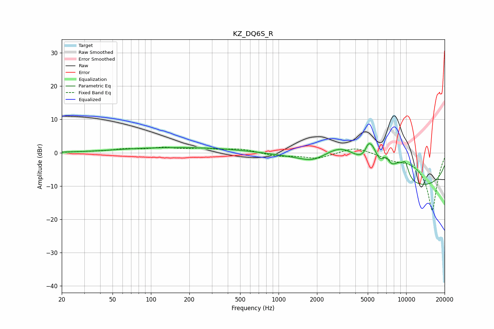

# KZ_DQ6S_R
See [usage instructions](https://github.com/jaakkopasanen/AutoEq#usage) for more options and info.

### Parametric EQs
Apply preamp of -2.8 dB when using parametric equalizer.

|   # | Type    |   Fc (Hz) |    Q |   Gain (dB) |
|-----|---------|-----------|------|-------------|
|   1 | Peaking |        75 | 0.56 |         0.6 |
|   2 | Peaking |       247 | 0.36 |         1.4 |
|   3 | Peaking |      1868 | 1.48 |        -1.8 |
|   4 | Peaking |      3157 | 0.86 |         8.3 |
|   5 | Peaking |      5042 | 5.58 |         2.9 |
|   6 | Peaking |      5454 | 3.4  |         5.3 |
|   7 | Peaking |      6949 | 4.35 |         3.6 |
|   8 | Peaking |      8696 | 2.41 |         4.5 |
|   9 | Peaking |      9854 | 4.64 |         4   |
|  10 | Peaking |      9952 | 0.18 |       -10.9 |

### Fixed Band EQs
When using fixed band (also called graphic) equalizer, apply preamp of **-1.8 dB** (if available) and set gains manually with these parameters.

|   # | Type    |   Fc (Hz) |    Q |   Gain (dB) |
|-----|---------|-----------|------|-------------|
|   1 | Peaking |        31 | 1.41 |         0.2 |
|   2 | Peaking |        62 | 1.41 |         0.9 |
|   3 | Peaking |       125 | 1.41 |         1.3 |
|   4 | Peaking |       250 | 1.41 |         1   |
|   5 | Peaking |       500 | 1.41 |         1.1 |
|   6 | Peaking |      1000 | 1.41 |        -1   |
|   7 | Peaking |      2000 | 1.41 |        -1.7 |
|   8 | Peaking |      4000 | 1.41 |         1.9 |
|   9 | Peaking |      8000 | 1.41 |        -1.5 |
|  10 | Peaking |     16000 | 1.41 |       -17.4 |

### Graphs

