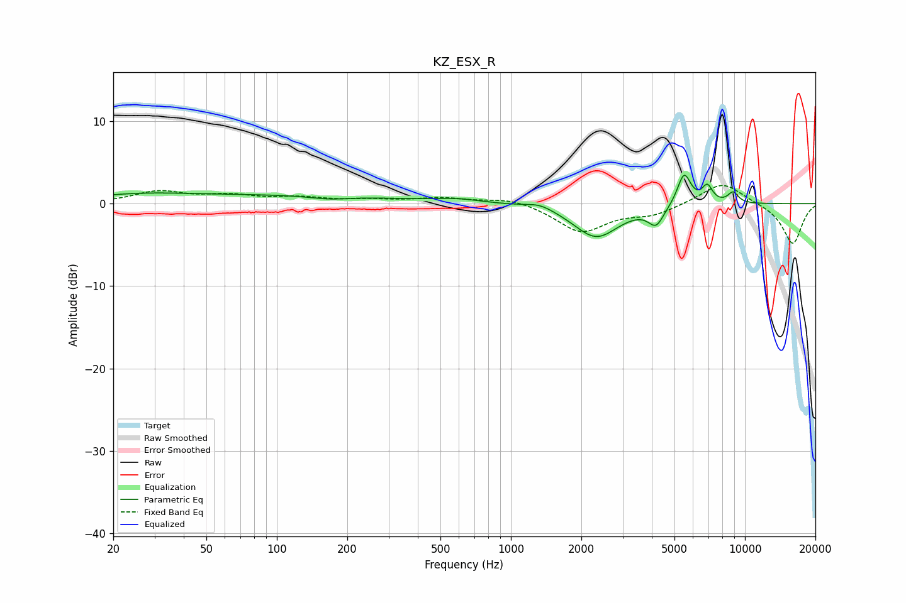

# KZ_ESX_R
See [usage instructions](https://github.com/jaakkopasanen/AutoEq#usage) for more options and info.

### Parametric EQs
Apply preamp of -3.6 dB when using parametric equalizer.

|   # | Type    |   Fc (Hz) |    Q |   Gain (dB) |
|-----|---------|-----------|------|-------------|
|   1 | Peaking |        25 | 0.64 |         0.8 |
|   2 | Peaking |       111 | 0.28 |         1   |
|   3 | Peaking |       167 | 1.67 |        -0.4 |
|   4 | Peaking |       595 | 1.53 |         0.4 |
|   5 | Peaking |      1329 | 2.4  |         0.7 |
|   6 | Peaking |      2314 | 1.46 |        -4.1 |
|   7 | Peaking |      4173 | 4.27 |        -2.2 |
|   8 | Peaking |      5496 | 4.76 |         3.9 |
|   9 | Peaking |      6908 | 6    |         2   |
|  10 | Peaking |      8898 | 5.64 |         1.3 |

### Fixed Band EQs
When using fixed band (also called graphic) equalizer, apply preamp of **-2.3 dB** (if available) and set gains manually with these parameters.

|   # | Type    |   Fc (Hz) |    Q |   Gain (dB) |
|-----|---------|-----------|------|-------------|
|   1 | Peaking |        31 | 1.41 |         1.4 |
|   2 | Peaking |        62 | 1.41 |         0.9 |
|   3 | Peaking |       125 | 1.41 |         0.6 |
|   4 | Peaking |       250 | 1.41 |         0.4 |
|   5 | Peaking |       500 | 1.41 |         0.6 |
|   6 | Peaking |      1000 | 1.41 |         0.7 |
|   7 | Peaking |      2000 | 1.41 |        -3.4 |
|   8 | Peaking |      4000 | 1.41 |        -1.2 |
|   9 | Peaking |      8000 | 1.41 |         2.7 |
|  10 | Peaking |     16000 | 1.41 |        -4.9 |

### Graphs

