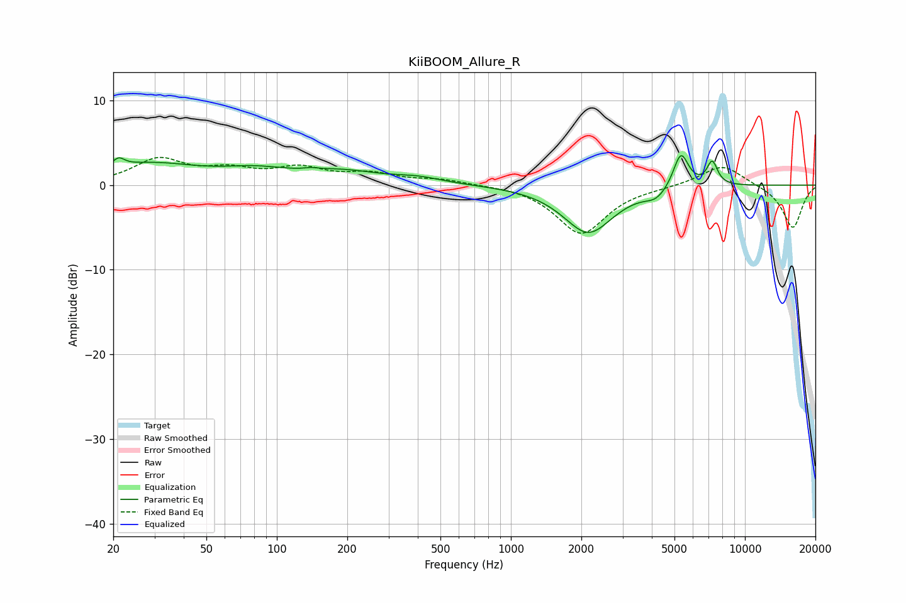

# KiiBOOM_Allure_R
See [usage instructions](https://github.com/jaakkopasanen/AutoEq#usage) for more options and info.

### Parametric EQs
Apply preamp of -3.6 dB when using parametric equalizer.

|   # | Type    |   Fc (Hz) |    Q |   Gain (dB) |
|-----|---------|-----------|------|-------------|
|   1 | Peaking |        21 | 5.74 |         1   |
|   2 | Peaking |        28 | 0.66 |         2.4 |
|   3 | Peaking |        81 | 0.96 |         1.3 |
|   4 | Peaking |       140 | 5.15 |         0.2 |
|   5 | Peaking |       191 | 0.86 |         1.4 |
|   6 | Peaking |       400 | 1.33 |         0.7 |
|   7 | Peaking |      2142 | 1.33 |        -5.6 |
|   8 | Peaking |      4182 | 2.92 |        -1.1 |
|   9 | Peaking |      5326 | 4.21 |         4.3 |
|  10 | Peaking |      7247 | 5.95 |         2.8 |

### Fixed Band EQs
When using fixed band (also called graphic) equalizer, apply preamp of **-3.4 dB** (if available) and set gains manually with these parameters.

|   # | Type    |   Fc (Hz) |    Q |   Gain (dB) |
|-----|---------|-----------|------|-------------|
|   1 | Peaking |        31 | 1.41 |         2.9 |
|   2 | Peaking |        62 | 1.41 |         1.5 |
|   3 | Peaking |       125 | 1.41 |         1.8 |
|   4 | Peaking |       250 | 1.41 |         1.2 |
|   5 | Peaking |       500 | 1.41 |         0.6 |
|   6 | Peaking |      1000 | 1.41 |         0.1 |
|   7 | Peaking |      2000 | 1.41 |        -5.8 |
|   8 | Peaking |      4000 | 1.41 |        -0.1 |
|   9 | Peaking |      8000 | 1.41 |         2.5 |
|  10 | Peaking |     16000 | 1.41 |        -5.1 |

### Graphs

