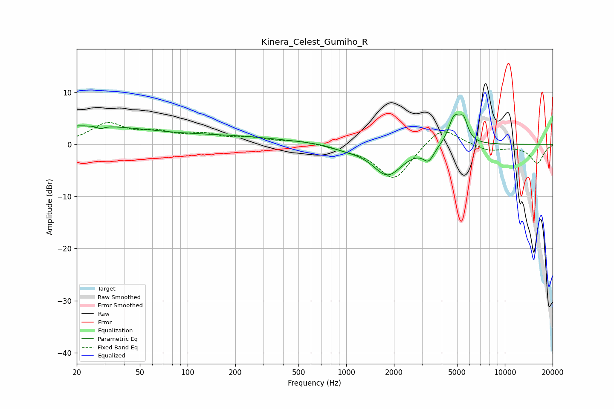

# Kinera_Celest_Gumiho_R
See [usage instructions](https://github.com/jaakkopasanen/AutoEq#usage) for more options and info.

### Parametric EQs
Apply preamp of -5.8 dB when using parametric equalizer.

|   # | Type    |   Fc (Hz) |    Q |   Gain (dB) |
|-----|---------|-----------|------|-------------|
|   1 | Peaking |        21 | 0.31 |         3.5 |
|   2 | Peaking |        28 | 5.8  |         2.2 |
|   3 | Peaking |        28 | 5.95 |        -2.7 |
|   4 | Peaking |       192 | 0.42 |         1.3 |
|   5 | Peaking |       777 | 1.06 |         0.3 |
|   6 | Peaking |       965 | 1.5  |        -0.7 |
|   7 | Peaking |      1822 | 1.48 |        -5.8 |
|   8 | Peaking |      3309 | 4.11 |        -2.5 |
|   9 | Peaking |      4795 | 3.75 |         5.2 |
|  10 | Peaking |      5493 | 5.31 |         3.6 |

### Fixed Band EQs
When using fixed band (also called graphic) equalizer, apply preamp of **-4.3 dB** (if available) and set gains manually with these parameters.

|   # | Type    |   Fc (Hz) |    Q |   Gain (dB) |
|-----|---------|-----------|------|-------------|
|   1 | Peaking |        31 | 1.41 |         3.8 |
|   2 | Peaking |        62 | 1.41 |         1.9 |
|   3 | Peaking |       125 | 1.41 |         1.6 |
|   4 | Peaking |       250 | 1.41 |         1   |
|   5 | Peaking |       500 | 1.41 |         0.6 |
|   6 | Peaking |      1000 | 1.41 |        -0.5 |
|   7 | Peaking |      2000 | 1.41 |        -6.9 |
|   8 | Peaking |      4000 | 1.41 |         3.8 |
|   9 | Peaking |      8000 | 1.41 |        -1.3 |
|  10 | Peaking |     16000 | 1.41 |        -3.6 |

### Graphs

