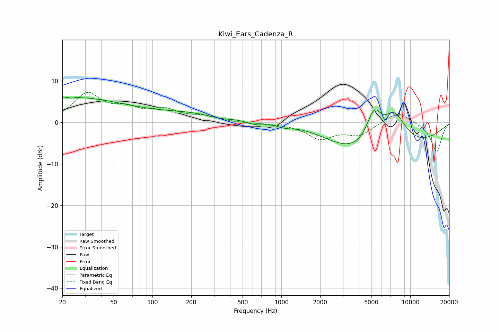

# Kiwi_Ears_Cadenza_R
See [usage instructions](https://github.com/jaakkopasanen/AutoEq#usage) for more options and info.

### Parametric EQs
Apply preamp of -6.2 dB when using parametric equalizer.

|   # | Type    |   Fc (Hz) |    Q |   Gain (dB) |
|-----|---------|-----------|------|-------------|
|   1 | Peaking |        20 | 0.28 |         6.2 |
|   2 | Peaking |        25 | 5.09 |        -2.4 |
|   3 | Peaking |        25 | 5.65 |         2.1 |
|   4 | Peaking |       349 | 1.01 |        -1.9 |
|   5 | Peaking |       631 | 1.5  |        -2.1 |
|   6 | Peaking |       676 | 0.22 |         3.9 |
|   7 | Peaking |      1055 | 1.68 |        -1.5 |
|   8 | Peaking |      5221 | 2.08 |         9.3 |
|   9 | Peaking |      5597 | 0.36 |       -13.3 |
|  10 | Peaking |      7514 | 1.16 |        11.7 |

### Fixed Band EQs
When using fixed band (also called graphic) equalizer, apply preamp of **-7.4 dB** (if available) and set gains manually with these parameters.

|   # | Type    |   Fc (Hz) |    Q |   Gain (dB) |
|-----|---------|-----------|------|-------------|
|   1 | Peaking |        31 | 1.41 |         6.7 |
|   2 | Peaking |        62 | 1.41 |         2.7 |
|   3 | Peaking |       125 | 1.41 |         2.6 |
|   4 | Peaking |       250 | 1.41 |         1.3 |
|   5 | Peaking |       500 | 1.41 |        -0.1 |
|   6 | Peaking |      1000 | 1.41 |        -0.2 |
|   7 | Peaking |      2000 | 1.41 |        -3.7 |
|   8 | Peaking |      4000 | 1.41 |        -2.8 |
|   9 | Peaking |      8000 | 1.41 |         2.8 |
|  10 | Peaking |     16000 | 1.41 |        -7.2 |

### Graphs

