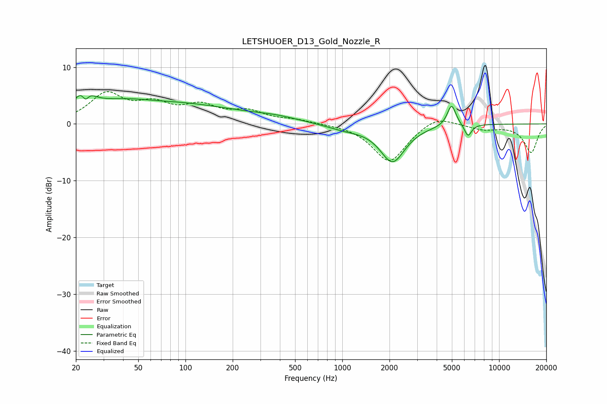

# LETSHUOER_D13_Gold_Nozzle_R
See [usage instructions](https://github.com/jaakkopasanen/AutoEq#usage) for more options and info.

### Parametric EQs
Apply preamp of -5.1 dB when using parametric equalizer.

|   # | Type    |   Fc (Hz) |    Q |   Gain (dB) |
|-----|---------|-----------|------|-------------|
|   1 | Peaking |        23 | 3.37 |         4.7 |
|   2 | Peaking |        23 | 5.9  |        -3.5 |
|   3 | Peaking |        45 | 0.41 |         4.2 |
|   4 | Peaking |        63 | 1    |        -0.5 |
|   5 | Peaking |       161 | 0.5  |         1.5 |
|   6 | Peaking |       377 | 0.96 |         0.7 |
|   7 | Peaking |      1035 | 1.2  |        -0.8 |
|   8 | Peaking |      2092 | 1.77 |        -6.6 |
|   9 | Peaking |      4979 | 5.07 |         3.8 |
|  10 | Peaking |      6335 | 6    |        -2.2 |

### Fixed Band EQs
When using fixed band (also called graphic) equalizer, apply preamp of **-5.8 dB** (if available) and set gains manually with these parameters.

|   # | Type    |   Fc (Hz) |    Q |   Gain (dB) |
|-----|---------|-----------|------|-------------|
|   1 | Peaking |        31 | 1.41 |         5   |
|   2 | Peaking |        62 | 1.41 |         2.9 |
|   3 | Peaking |       125 | 1.41 |         2.8 |
|   4 | Peaking |       250 | 1.41 |         1.9 |
|   5 | Peaking |       500 | 1.41 |         0.6 |
|   6 | Peaking |      1000 | 1.41 |         0.1 |
|   7 | Peaking |      2000 | 1.41 |        -6.8 |
|   8 | Peaking |      4000 | 1.41 |         1.8 |
|   9 | Peaking |      8000 | 1.41 |        -0.9 |
|  10 | Peaking |     16000 | 1.41 |        -5   |

### Graphs

